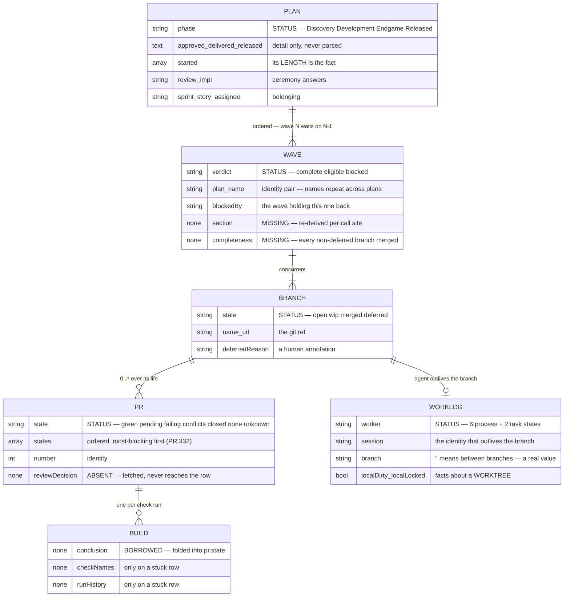

# The board's domain model

Six entities — **plan · wave · branch · pr · worklog · build** — with their
properties, their relations, and who owns each status.

Companion to [`board-entity-properties.md`](board-entity-properties.md), which
inventories what exists today. This says what the entities *are*. Every value
below is measured from the live payload, the parser, or the helper scripts;
where an entity lacks something, that is stated rather than invented.

## The relations



**Cardinalities that are not obvious, and each is measured:**

- **plan → wave is ORDERED.** A wave is eligible only once every non-deferred
  branch in every *prior* wave is merged. This is the only ordered relation.
- **wave → branch is CONCURRENT.** Branches within a wave may run at once; that
  is what a wave means.
- **branch → PR is 0..n, not 0..1.** A branch can carry several PRs over its
  life — opened, closed, reopened — and `prOutranks` picks which one the row
  points at (OPEN over MERGED over CLOSED).
- **branch → worklog is 0..1**, and the worklog outlives the branch: an agent
  finishes one branch and takes another. `AgentEntry`'s docstring is explicit —
  *"a branch is what an agent is working on, never what it is."*
- **PR → build is 0..n** — one check run per workflow.

**And two the diagram cannot say, because they are about identity rather than
counting:**

- **A wave's identity is the PAIR `(plan, name)`, never the name.** Wave names
  repeat across the estate — `Shaped` appears in several plans, `Says` in three —
  so any map keyed on the name alone collides. `openWaves` keys on
  `plan\0wave` for this reason, and so does `BlockedByMark`'s lookup.
- **A branch belongs to ONE wave, but may be NAMED by two plans.** Measured
  2026-08-22: `feature/the-registry-knows-which-agents-live` was declared by both
  `approval-hands-the-work-to-agents` and `every-section-has-one-subject`, and
  the board reported `claimed twice`. The git ref is single; the declaration is
  not. That is a real estate state, not a modelling error — the board's job is to
  surface it, which it did.

**Cardinality is a claim that can be violated, and one is today.** *A wave
renders in exactly one section* is the invariant, and `Inverted` breaks it — one
merged branch and one open branch, so two section predicates both claim the wave.
See `the-wave-is-a-thing-the-board-can-hold`.

## Creation lifecycle

Each entity is brought into being by a different act, and they are not equally
ceremonious. The order is fixed — nothing downstream can exist before its
upstream does.

```mermaid
stateDiagram-v2
    direction LR

    [*] --> PlanFile : /plot-idea writes docs/plans/&lt;date&gt;-&lt;slug&gt;.md

    state "PLAN — a file on a branch" as PlanFile
    state "WAVE — a ### heading" as WaveHeading
    state "BRANCH — a claimed ref" as BranchRef
    state "WORKLOG — a manifest" as Manifest
    state "PR — opened by the worker" as PullRequest
    state "BUILD — a check run" as CheckRun

    PlanFile --> WaveHeading : written by hand, in prose
    WaveHeading --> BranchRef : claim push (empty commit)
    BranchRef --> Manifest : plot-dispatch.sh spawns an agent
    BranchRef --> PullRequest : the worker opens it
    PullRequest --> CheckRun : CI reacts to the head sha

    note right of WaveHeading
        NO CREATION EVENT.
        A wave exists the moment
        somebody types ###.
        Nothing validates it.
    end note

    note right of Manifest
        Optional. A branch worked
        by a human has no manifest
        and is not less real.
    end note
```

### Who creates what, and when

| entity | created by | at what moment | can it be refused? |
|---|---|---|---|
| **plan** | `/plot-idea` | a file is written and committed | yes — slug collision is a hard gate |
| **wave** | *a human typing `### `* | **no event** — it exists on write | **no** |
| **branch** | `git push -u origin <branch>` | the **claim**, before any work | yes — the push is rejected if it exists |
| **worklog** | `plot-dispatch.sh` | an agent is spawned | n/a |
| **pr** | the implementing session | first real commit is pushed | by the host |
| **build** | CI | a head sha appears | n/a |

### The claim is the only atomic creation

```
git checkout -b "$BRANCH" "origin/$DEFAULT_BRANCH"
git push -u origin "$BRANCH"          # ← THE CLAIM
```

**The claim carries an EMPTY COMMIT, and that is load-bearing.** A branch merely
pointing at `origin/main` pushes as a no-op — the remote already has that commit,
so the push succeeds with *"Everything up-to-date"* and **both** dispatchers
believe they own the branch. Mutual exclusion needs a ref the remote does not
already have.

That makes the branch the one entity whose creation is a lock. There is no lock
manager and none is wanted: pushing a ref that already exists is rejected, so two
sessions racing cannot both win. The loser asks `--next` for another branch.

### A wave is born in prose, and that is the defect

A wave has **no creation step at all** — no file, no ref, no registration. It
exists the moment a `### ` heading is written inside `## Branches`, and nothing
validates that it was meant.

**Measured consequence:** a backticked branch name mentioned in an *explanatory
table* inside `## Branches` was parsed as a declaration, read as `eligible` by
the fleet scan, and **dispatched to an agent**. The correction file an operator
left in that worktree says it plainly:

> `bug/one-column-one-kind-of-fact` was never an intended branch. It appeared in
> the plan's `## Branches` section as a backticked prose mention inside an
> explanatory table.

Two branches were created for work nobody had planned. That is what *no creation
event* costs: there is no step at which a wave can be refused, because there is
no step.

### Lifetimes differ from creation order

- **A plan outlives its waves.** Delivered and Released plans keep their waves as
  history.
- **A worklog outlives its branch.** An agent finishes one and takes another;
  `branch: ''` is the state between. The manifest is keyed on the *session*, not
  the branch, for exactly this reason.
- **A branch outlives its worktree.** Cleaning a worktree does not delete the
  ref, and `/plot-reconcile` deliberately never deletes a remote ref another
  session may be reading.
- **A build outlives nothing** — it belongs to a commit, so a rebase orphans it.
  This is why a CI waiter must pin the head sha.

## PLAN

The one entity with a complete existing model: `plot-plan-meta.sh` emits 26
fields and `pnpm run test:reconcile` tests it.

| property | type | values |
|---|---|---|
| `slug` | id | from the filename |
| `file` | path | `YYYY-MM-DD-<slug>.md` |
| `title` · `type` | text | `feature` · `bug` · `docs` · `infra` |
| **`phase`** | **status** | Discovery · Development · Endgame · Released *(+ Design, defined and unused)* |
| `review` · `impl` | ceremony | `pr`·`in-session`·`ballot` / `own-branches`·`same-branch`·`other-repo`·`none` |
| `sprint` · `story` · `assignee` · `issues[]` | belonging | free text / ids |
| `approved` · `delivered` · `released` · `design` | **record, text** | the raw line; display only |
| `started[]` | **record, array** | one entry per started branch — its LENGTH is a fact |
| `changelog[]` | text | release-note entries |

**Status ownership:** `phase` answers *is this committed to, and how far has it
gone*. It is the plan's and nothing else's.

**The records are detail, not lifecycle.** Measured over 104 plans: three
*released* plans carry no released record and one approved plan carries no
approval record. Deriving phase from records would demote all four. Only
`started[]` may be read structurally, and only for its length.

**Absent by design:** there is no partial approval. A plan is Draft or Approved.

## WAVE

**The entity that does not exist yet.** Its three properties are stamped on every
branch row because there is no object to hold them.

| property | type | values |
|---|---|---|
| `plan` + `name` | id | the pair — wave names repeat across plans |
| `branches[]` | relation | 1..n, concurrent |
| **`verdict`** | **status** | complete · eligible · blocked |
| `blockedBy` | relation | the wave holding this one back, by name |

**Status ownership:** `verdict` answers *may this slice be started, and is it
finished*.

**Measured proof it is the wave's and not the branch's:** across 82 waves,
**zero** have branches that disagree on `verdict`, and **one** has branches that
disagree on `state` (`Inverted`: one merged, one open, verdict constant at
`eligible`). A property that cannot vary within a wave belongs to the wave.

**What it needs and lacks:** a section (one), a branch count, a completeness
(*every non-deferred branch merged*), and whether its branches disagree. All four
are re-derived per call site today, which is the abstraction gap
`the-wave-is-a-thing-the-board-can-hold` addresses.

**An unnamed wave is still a wave** — a plan with no `### ` subheadings is one
wave, per the manifesto. What it lacks is a label.

## BRANCH

| property | type | values |
|---|---|---|
| `name` | id | the git ref |
| `url` | text | host URL, `""` where unknown |
| **`state`** | **status** | open · wip · merged · deferred |
| `deferredReason` | text | from `<!-- deferred: -->`, `""` otherwise |
| `localDirty` · `localLocked` · `localAhead` | **worktree facts** | see WORKLOG |

**Status ownership:** `state` answers *what happened to this ref*. It is the
branch's, and reading it for a wave question is the direct cause of a merged
branch of an unfinished wave appearing in DONE.

**`deferred` is a human annotation, not a computed state** — it means somebody
decided this branch is not needed, and it is orthogonal to the wave's verdict.

**The three `local*` fields are listed here because they arrive on the row, and
they are NOT the branch's** — they describe the worktree a branch is checked out
in. A merged branch whose stale worktree holds an edited file reports
`localDirty: true`, which is true about the worktree and false about the work.

## PR

| property | type | values |
|---|---|---|
| `number` · `url` | id | |
| `draft` | bool | |
| **`state`** | **status** | green · pending · failing · none · conflicts · unknown · closed |
| `states[]` | ordered set | most-blocking first — **PR #332, open** |
| `failingChecks[]` | relation | names of the checks that failed |

**Status ownership:** `state` answers *what the host says about this proposal*.

**It currently conflates two entities.** `conflicts` and `closed` are facts about
the *PR*; `green`/`pending`/`failing` are facts about the *build*. One enum
cannot hold both, which is why a PR that conflicts **and** has a failed build
reported only `conflicts`. PR #332 adds `states[]` as an ordered set for exactly
this, with `state` derived as `states[0]`.

**Absent:** review state (`reviewDecision`) travels in `pr-list --rich` and does
not reach the row.

## WORKLOG

The agent, and it is deliberately not the branch.

| property | type | values |
|---|---|---|
| `session` | id | the dispatcher's session id — the identity |
| `branch` | relation | the branch it holds, or `''` **while it holds none** |
| `worktree` | path | where it works |
| **`worker`** | **status** | see below |
| `localDirty` · `localLocked` | worktree facts | `git status` in that worktree |
| `localAhead` | int | unpushed commits |
| `changedAgo` | int | mtime of the most recent change |

**Status ownership:** `worker` answers *is an agent alive, waiting, or stalled*.
`plot-worker-state.sh` defines **eight** values in two kinds:

```
six PROCESS states   running · finished · failed · ended · none · elsewhere
two TASK states      waiting · stalled
```

The task states exist because **every worker exits 0**, so the exit code cannot
say whether the work is done. `finished` is refined by the *tree*:

| evidence in the worktree | state | meaning |
|---|---|---|
| process alive | `running` | leave it alone |
| an open or merged PR | `finished` | the work reached review |
| a `PLOT-BLOCKED:` marker | `waiting` | a person owes it an answer |
| uncommitted or unpushed work, no PR | `stalled` | work on the floor |
| nothing left behind | `finished` | done |

**The identity outlives the branch.** An agent finishes one branch and takes
another; `branch: ''` is a real value meaning *between branches*, not a gap.

**`localDirty` is a worktree fact, not a work fact** — the distinction that made
DONE wear an activity mark for merged branches whose worktrees still held an
edited test fixture.

## BUILD

**The entity with no home.** It exists in the world and nowhere in the model.

| property | where it lives today |
|---|---|
| overall conclusion | folded into `pr.state` as one word |
| per-check name | `stuck.failingChecks[]` — **only when a row is stuck** |
| run history | `stuck.runHistory[]` — same condition |
| the run itself | `plot-host.sh runs`, fetched, consumed only by the stuck path |

**Status ownership:** none — it is borrowed from the PR.

**What that costs, measured on 2026-08-17:** a markdown-only branch failed
`validate` because a CDN returned 403. What proved it transient was the *run
history* — the same branch had been green two minutes earlier. A real failure
presents identically in every other respect. The history exists and only a
stuck row consumes it.

**A build belongs to a commit, not to a PR** — which is why a CI waiter must pin
the head sha, and why a green run on an older commit is not a green PR.

## Phase constraints — what must exist, and with what values

A phase is a claim about the world. These are the abstractions that must exist
for the claim to be true, measured against all 104 plans so every rule is one the
estate can be held to rather than one it merely ought to obey.

### The table

| | Draft | Approved | Delivered | Released |
|---|---|---|---|---|
| **wave** ≥ 1 | required | required | required | required |
| **branch** ≥ 1 *(or `Impl: none`)* | required | required | required | required |
| `approved` record | **forbidden** | required | required | required |
| `started[]` | **forbidden** | *optional* | expected | expected |
| **PR** | **forbidden** | *optional* | expected | expected |
| `delivered` record | **forbidden** | **forbidden** | required | required |
| `released` record | **forbidden** | **forbidden** | **forbidden** | required |
| every non-deferred **branch** merged | no | no | **required** | required |

**Measured against the estate, 2026-08-23:**

```
DRAFT      16 plans   0/16 approved · 0/16 started · 0/16 PR · 0/16 delivered · 0/16 released
APPROVED   10 plans   9/10 approved · 5/10 started · 4/10 PR
DELIVERED   4 plans   4/4  approved · 3/4  started · 4/4 delivered
RELEASED   70 plans  65/70 approved · 61/70 started · 67/70 delivered · 67/70 released
```

### Draft is perfectly clean, and that makes it a gate

**Zero of sixteen Draft plans carry any record** — no approval, no start, no PR,
no delivery, no release. The estate has never violated this, so *Draft ⇒ no
records* can be enforced today rather than aspired to.

That is also the strongest form of the answer to *is this plan partially
approved*: it cannot be. A record's presence on a Draft would be corruption, not
drift.

### The violations run one way only

Every failure in the estate is a record **missing**, never a record **present too
early**:

| what is wrong | plans |
|---|---|
| approved/delivered/released with **no approval record** | `board-sync`, `reconcile-drift-loop`, `kanban-board-v1`, `opus5-longhorizon-hardening`, `the-index-is-derived`, `the-no-ref-arm-asks-once-too` |
| released with **no delivered record** and **no released record** | `reconcile-scan-accuracy`, `board-reads-git`, `push-main-bypass` |

Nine plans, six violations, and **not one of them has a record it should not
have.**

**That asymmetry is the design, and the constraint model must respect it.**
Records are written by commands and sometimes not written at all — a plan
delivered by hand before `/plot-deliver` existed has no record and is still
delivered. So:

- **A record present too early is REFUSED.** It cannot happen by accident; it
  means the phase and the record disagree about what occurred.
- **A record absent late is REPORTED.** It is bookkeeping drift, and the phase
  remains authoritative. This is why `phase` and not the records determines the
  lifecycle — the three plans above are genuinely released.

### What each phase requires of the OTHER entities

The table above is about the plan's own fields. These are the cross-entity
constraints, and they are what the board actually needs:

**Draft**
- waves exist, branches are *named* — but **no branch ref need exist**. The
  branches of a Draft plan are names in prose, which is exactly how a prose
  mention became a dispatched branch.
- **no worklog may exist** — nothing has been dispatched.

**Approved**
- every branch may be claimed; `started[]` records which were.
- **`started[].length` is the only structural start signal.** Measured: 5 of 10
  approved plans have started and 5 have not, identical `phase`, opposite answers
  to *can I pick this up*.

**Delivered**
- **every non-deferred branch has a merged PR.** This is `/plot-deliver`'s hard
  gate, and the one cross-entity rule already enforced.
- a `deferred` branch is exempt — its annotation is a human decision.

**Released**
- everything Delivered requires, plus a version. The version is resolved from
  `git tag --contains`, **not** from the `released` record: a plan booked
  2026-08-19 had shipped in v2.5.0, and dates get this wrong where ancestry
  cannot.

### The wave constraint the phases imply

A phase is a claim about the plan; a **wave verdict** is a claim about a slice.
They must agree at the boundaries:

- **Delivered ⇒ every wave `complete`.** A plan cannot be delivered with an
  eligible or blocked wave; that is the same gate as *every branch merged*, one
  level up.
- **Draft ⇒ no wave may be `complete`… except it can.** Measured:
  `a-wave-is-a-thing-not-a-label` is a Draft plan with a merged, complete wave.
  Someone did the work before the plan was approved.

**That second line is deliberately not a rule.** It is a real state and refusing
it would refuse work that exists. The board's job is to render it truthfully —
which is exactly what it failed to do when DONE admitted that Discovery plan.

## The rule this model exists to enforce

**A question is answered by the status of the entity it is about.**

| question | ask |
|---|---|
| is this committed to? | plan `phase` |
| may this slice start? | wave `verdict` |
| what happened to this ref? | branch `state` |
| what does the host say? | pr `state` |
| is an agent alive? | worklog `worker` |
| did CI pass? | build — **and it has no field** |

Where an answer genuinely needs several inputs — and the row's *section* does —
the combination happens in exactly **one** function (`classify`) and nowhere
else. Every second derivation is a place for two owners' statuses to be read in
the wrong order, which is what every board defect this week has been.

## What is deliberately NOT modelled

- **A plan's section.** A plan appears wherever its waves are.
- **A wave's own phase.** A wave inherits its plan's; it has a verdict.
- **A branch's build.** A build belongs to a commit.
- **A second `status` field anywhere.** The word already means three things here
  — the plan file's `## Status` *section*, the story lifecycle `status`, and the
  row's rendered `tuple.status`.
