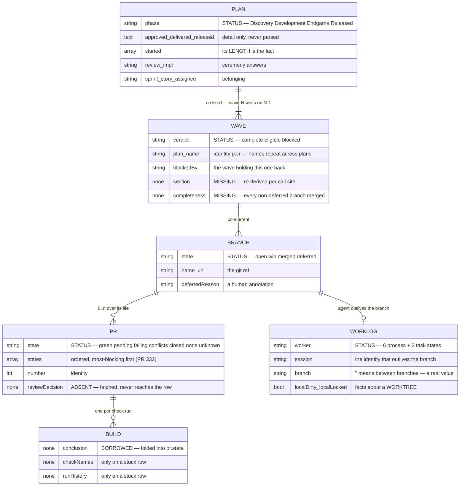
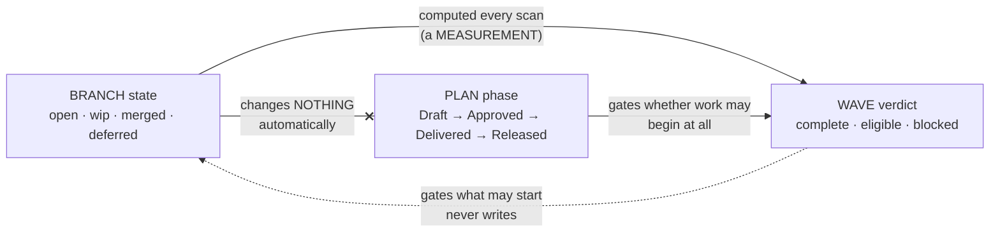
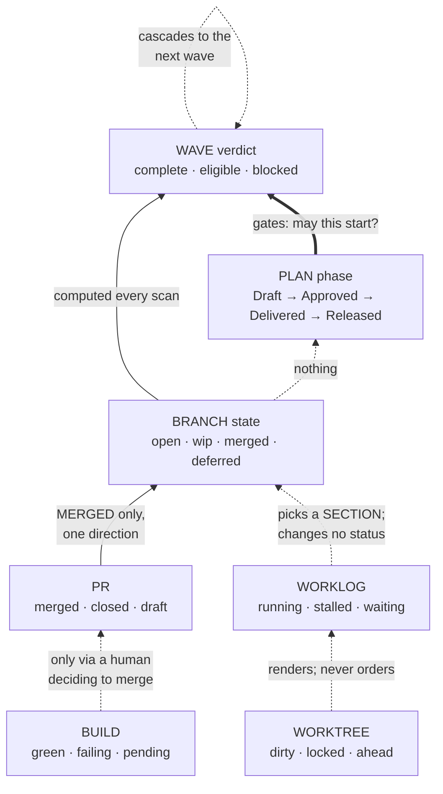

# The board's domain model

Six entities — **plan · wave · branch · pr · worklog · build** — with their
properties, their relations, and who owns each status.

Companion to [`board-entity-properties.md`](board-entity-properties.md), which
inventories what exists today. This says what the entities *are*. Every value
below is measured from the live payload, the parser, or the helper scripts;
where an entity lacks something, that is stated rather than invented.

## The relations



**Cardinalities that are not obvious, and each is measured:**

- **plan → wave is ORDERED.** A wave is eligible only once every non-deferred
  branch in every *prior* wave is merged. This is the only ordered relation.
- **wave → branch is CONCURRENT.** Branches within a wave may run at once; that
  is what a wave means.
- **branch → PR is 0..n, not 0..1.** A branch can carry several PRs over its
  life — opened, closed, reopened — and `prOutranks` picks which one the row
  points at (OPEN over MERGED over CLOSED).
- **branch → worklog is 0..1**, and the worklog outlives the branch: an agent
  finishes one branch and takes another. `AgentEntry`'s docstring is explicit —
  *"a branch is what an agent is working on, never what it is."*
- **PR → build is 0..n** — one check run per workflow.

**And two the diagram cannot say, because they are about identity rather than
counting:**

- **A wave's identity is the PAIR `(plan, name)`, never the name.** Wave names
  repeat across the estate — `Shaped` appears in several plans, `Says` in three —
  so any map keyed on the name alone collides. `openWaves` keys on
  `plan\0wave` for this reason, and so does `BlockedByMark`'s lookup.
- **A branch belongs to ONE wave, but may be NAMED by two plans.** Measured
  2026-08-22: `feature/the-registry-knows-which-agents-live` was declared by both
  `approval-hands-the-work-to-agents` and `every-section-has-one-subject`, and
  the board reported `claimed twice`. The git ref is single; the declaration is
  not. That is a real estate state, not a modelling error — the board's job is to
  surface it, which it did.

**Cardinality is a claim that can be violated, and one is today.** *A wave
renders in exactly one section* is the invariant, and `Inverted` breaks it — one
merged branch and one open branch, so two section predicates both claim the wave.
See `the-wave-is-a-thing-the-board-can-hold`.

## Creation lifecycle

Each entity is brought into being by a different act, and they are not equally
ceremonious. The order is fixed — nothing downstream can exist before its
upstream does.

```mermaid
stateDiagram-v2
    direction LR

    [*] --> PlanFile : /plot-idea writes docs/plans/&lt;date&gt;-&lt;slug&gt;.md

    state "PLAN — a file on a branch" as PlanFile
    state "WAVE — a ### heading" as WaveHeading
    state "BRANCH — a claimed ref" as BranchRef
    state "WORKLOG — a manifest" as Manifest
    state "PR — opened by the worker" as PullRequest
    state "BUILD — a check run" as CheckRun

    PlanFile --> WaveHeading : written by hand, in prose
    WaveHeading --> BranchRef : claim push (empty commit)
    BranchRef --> Manifest : plot-dispatch.sh spawns an agent
    BranchRef --> PullRequest : the worker opens it
    PullRequest --> CheckRun : CI reacts to the head sha

    note right of WaveHeading
        NO CREATION EVENT.
        A wave exists the moment
        somebody types ###.
        Nothing validates it.
    end note

    note right of Manifest
        Optional. A branch worked
        by a human has no manifest
        and is not less real.
    end note
```

### Who creates what, and when

| entity | created by | at what moment | can it be refused? |
|---|---|---|---|
| **plan** | `/plot-idea` | a file is written and committed | yes — slug collision is a hard gate |
| **wave** | *a human typing `### `* | **no event** — it exists on write | **no** |
| **branch** | `git push -u origin <branch>` | the **claim**, before any work | yes — the push is rejected if it exists |
| **worklog** | `plot-dispatch.sh` | an agent is spawned | n/a |
| **pr** | the implementing session | first real commit is pushed | by the host |
| **build** | CI | a head sha appears | n/a |

### The claim is the only atomic creation

```
git checkout -b "$BRANCH" "origin/$DEFAULT_BRANCH"
git push -u origin "$BRANCH"          # ← THE CLAIM
```

**The claim carries an EMPTY COMMIT, and that is load-bearing.** A branch merely
pointing at `origin/main` pushes as a no-op — the remote already has that commit,
so the push succeeds with *"Everything up-to-date"* and **both** dispatchers
believe they own the branch. Mutual exclusion needs a ref the remote does not
already have.

That makes the branch the one entity whose creation is a lock. There is no lock
manager and none is wanted: pushing a ref that already exists is rejected, so two
sessions racing cannot both win. The loser asks `--next` for another branch.

### A wave is born in prose, and that is the defect

A wave has **no creation step at all** — no file, no ref, no registration. It
exists the moment a `### ` heading is written inside `## Branches`, and nothing
validates that it was meant.

**Measured consequence:** a backticked branch name mentioned in an *explanatory
table* inside `## Branches` was parsed as a declaration, read as `eligible` by
the fleet scan, and **dispatched to an agent**. The correction file an operator
left in that worktree says it plainly:

> `bug/one-column-one-kind-of-fact` was never an intended branch. It appeared in
> the plan's `## Branches` section as a backticked prose mention inside an
> explanatory table.

Two branches were created for work nobody had planned. That is what *no creation
event* costs: there is no step at which a wave can be refused, because there is
no step.

### Lifetimes differ from creation order

- **A plan outlives its waves.** Delivered and Released plans keep their waves as
  history.
- **A worklog outlives its branch.** An agent finishes one and takes another;
  `branch: ''` is the state between. The manifest is keyed on the *session*, not
  the branch, for exactly this reason.
- **A branch outlives its worktree.** Cleaning a worktree does not delete the
  ref, and `/plot-reconcile` deliberately never deletes a remote ref another
  session may be reading.
- **A build outlives nothing** — it belongs to a commit, so a rebase orphans it.
  This is why a CI waiter must pin the head sha.

## PLAN

The one entity with a complete existing model: `plot-plan-meta.sh` emits 26
fields and `pnpm run test:reconcile` tests it.

| property | type | values |
|---|---|---|
| `slug` | id | from the filename |
| `file` | path | `YYYY-MM-DD-<slug>.md` |
| `title` · `type` | text | `feature` · `bug` · `docs` · `infra` |
| **`phase`** | **status** | Discovery · Development · Endgame · Released *(+ Design, defined and unused)* |
| `review` · `impl` | ceremony | `pr`·`in-session`·`ballot` / `own-branches`·`same-branch`·`other-repo`·`none` |
| `sprint` · `story` · `assignee` · `issues[]` | belonging | free text / ids |
| `approved` · `delivered` · `released` · `design` | **record, text** | the raw line; display only |
| `started[]` | **record, array** | one entry per started branch — its LENGTH is a fact |
| `changelog[]` | text | release-note entries |

**Status ownership:** `phase` answers *is this committed to, and how far has it
gone*. It is the plan's and nothing else's.

**The records are detail, not lifecycle.** Measured over 104 plans: three
*released* plans carry no released record and one approved plan carries no
approval record. Deriving phase from records would demote all four. Only
`started[]` may be read structurally, and only for its length.

**Absent by design:** there is no partial approval. A plan is Draft or Approved.

## WAVE

**The entity that does not exist yet.** Its three properties are stamped on every
branch row because there is no object to hold them.

| property | type | values |
|---|---|---|
| `plan` + `name` | id | the pair — wave names repeat across plans |
| `branches[]` | relation | 1..n, concurrent |
| **`verdict`** | **status** | complete · eligible · blocked |
| `blockedBy` | relation | the wave holding this one back, by name |

**Status ownership:** `verdict` answers *may this slice be started, and is it
finished*.

**Measured proof it is the wave's and not the branch's:** across 82 waves,
**zero** have branches that disagree on `verdict`, and **one** has branches that
disagree on `state` (`Inverted`: one merged, one open, verdict constant at
`eligible`). A property that cannot vary within a wave belongs to the wave.

**What it needs and lacks:** a section (one), a branch count, a completeness
(*every non-deferred branch merged*), and whether its branches disagree. All four
are re-derived per call site today, which is the abstraction gap
`the-wave-is-a-thing-the-board-can-hold` addresses.

**An unnamed wave is still a wave** — a plan with no `### ` subheadings is one
wave, per the manifesto. What it lacks is a label.

## BRANCH

| property | type | values |
|---|---|---|
| `name` | id | the git ref |
| `url` | text | host URL, `""` where unknown |
| **`state`** | **status** | open · wip · merged · deferred |
| `deferredReason` | text | from `<!-- deferred: -->`, `""` otherwise |
| `localDirty` · `localLocked` · `localAhead` | **worktree facts** | see WORKLOG |

**Status ownership:** `state` answers *what happened to this ref*. It is the
branch's, and reading it for a wave question is the direct cause of a merged
branch of an unfinished wave appearing in DONE.

**`deferred` is a human annotation, not a computed state** — it means somebody
decided this branch is not needed, and it is orthogonal to the wave's verdict.

**The three `local*` fields are listed here because they arrive on the row, and
they are NOT the branch's** — they describe the worktree a branch is checked out
in. A merged branch whose stale worktree holds an edited file reports
`localDirty: true`, which is true about the worktree and false about the work.

## PR

| property | type | values |
|---|---|---|
| `number` · `url` | id | |
| `draft` | bool | |
| **`state`** | **status** | green · pending · failing · none · conflicts · unknown · closed |
| `states[]` | ordered set | most-blocking first — **PR #332, open** |
| `failingChecks[]` | relation | names of the checks that failed |

**Status ownership:** `state` answers *what the host says about this proposal*.

**It currently conflates two entities.** `conflicts` and `closed` are facts about
the *PR*; `green`/`pending`/`failing` are facts about the *build*. One enum
cannot hold both, which is why a PR that conflicts **and** has a failed build
reported only `conflicts`. PR #332 adds `states[]` as an ordered set for exactly
this, with `state` derived as `states[0]`.

**Absent:** review state (`reviewDecision`) travels in `pr-list --rich` and does
not reach the row.

## WORKLOG

The agent, and it is deliberately not the branch.

| property | type | values |
|---|---|---|
| `session` | id | the dispatcher's session id — the identity |
| `branch` | relation | the branch it holds, or `''` **while it holds none** |
| `worktree` | path | where it works |
| **`worker`** | **status** | see below |
| `localDirty` · `localLocked` | worktree facts | `git status` in that worktree |
| `localAhead` | int | unpushed commits |
| `changedAgo` | int | mtime of the most recent change |

**Status ownership:** `worker` answers *is an agent alive, waiting, or stalled*.
`plot-worker-state.sh` defines **eight** values in two kinds:

```
six PROCESS states   running · finished · failed · ended · none · elsewhere
two TASK states      waiting · stalled
```

The task states exist because **every worker exits 0**, so the exit code cannot
say whether the work is done. `finished` is refined by the *tree*:

| evidence in the worktree | state | meaning |
|---|---|---|
| process alive | `running` | leave it alone |
| an open or merged PR | `finished` | the work reached review |
| a `PLOT-BLOCKED:` marker | `waiting` | a person owes it an answer |
| uncommitted or unpushed work, no PR | `stalled` | work on the floor |
| nothing left behind | `finished` | done |

**The identity outlives the branch.** An agent finishes one branch and takes
another; `branch: ''` is a real value meaning *between branches*, not a gap.

**`localDirty` is a worktree fact, not a work fact** — the distinction that made
DONE wear an activity mark for merged branches whose worktrees still held an
edited test fixture.

## BUILD

**The entity with no home.** It exists in the world and nowhere in the model.

| property | where it lives today |
|---|---|
| overall conclusion | folded into `pr.state` as one word |
| per-check name | `stuck.failingChecks[]` — **only when a row is stuck** |
| run history | `stuck.runHistory[]` — same condition |
| the run itself | `plot-host.sh runs`, fetched, consumed only by the stuck path |

**Status ownership:** none — it is borrowed from the PR.

**What that costs, measured on 2026-08-17:** a markdown-only branch failed
`validate` because a CDN returned 403. What proved it transient was the *run
history* — the same branch had been green two minutes earlier. A real failure
presents identically in every other respect. The history exists and only a
stuck row consumes it.

**A build belongs to a commit, not to a PR** — which is why a CI waiter must pin
the head sha, and why a green run on an older commit is not a green PR.

## Phase constraints — what must exist, and with what values

A phase is a claim about the world. These are the abstractions that must exist
for the claim to be true, measured against all 104 plans so every rule is one the
estate can be held to rather than one it merely ought to obey.

### The table

| | Draft | Approved | Delivered | Released |
|---|---|---|---|---|
| **wave** ≥ 1 | required | required | required | required |
| **branch** ≥ 1 *(or `Impl: none`)* | required | required | required | required |
| `approved` record | **forbidden** | required | required | required |
| `started[]` | **forbidden** | *optional* | expected | expected |
| **PR** | **forbidden** | *optional* | expected | expected |
| `delivered` record | **forbidden** | **forbidden** | required | required |
| `released` record | **forbidden** | **forbidden** | **forbidden** | required |
| every non-deferred **branch** merged | no | no | **required** | required |

**Measured against the estate, 2026-08-23:**

```
DRAFT      16 plans   0/16 approved · 0/16 started · 0/16 PR · 0/16 delivered · 0/16 released
APPROVED   10 plans   9/10 approved · 5/10 started · 4/10 PR
DELIVERED   4 plans   4/4  approved · 3/4  started · 4/4 delivered
RELEASED   70 plans  65/70 approved · 61/70 started · 67/70 delivered · 67/70 released
```

### Draft is perfectly clean, and that makes it a gate

**Zero of sixteen Draft plans carry any record** — no approval, no start, no PR,
no delivery, no release. The estate has never violated this, so *Draft ⇒ no
records* can be enforced today rather than aspired to.

That is also the strongest form of the answer to *is this plan partially
approved*: it cannot be. A record's presence on a Draft would be corruption, not
drift.

### The violations run one way only

Every failure in the estate is a record **missing**, never a record **present too
early**:

| what is wrong | plans |
|---|---|
| approved/delivered/released with **no approval record** | `board-sync`, `reconcile-drift-loop`, `kanban-board-v1`, `opus5-longhorizon-hardening`, `the-index-is-derived`, `the-no-ref-arm-asks-once-too` |
| released with **no delivered record** and **no released record** | `reconcile-scan-accuracy`, `board-reads-git`, `push-main-bypass` |

Nine plans, six violations, and **not one of them has a record it should not
have.**

**That asymmetry is the design, and the constraint model must respect it.**
Records are written by commands and sometimes not written at all — a plan
delivered by hand before `/plot-deliver` existed has no record and is still
delivered. So:

- **A record present too early is REFUSED.** It cannot happen by accident; it
  means the phase and the record disagree about what occurred.
- **A record absent late is REPORTED.** It is bookkeeping drift, and the phase
  remains authoritative. This is why `phase` and not the records determines the
  lifecycle — the three plans above are genuinely released.

### What each phase requires of the OTHER entities

The table above is about the plan's own fields. These are the cross-entity
constraints, and they are what the board actually needs:

**Draft**
- waves exist, branches are *named* — but **no branch ref need exist**. The
  branches of a Draft plan are names in prose, which is exactly how a prose
  mention became a dispatched branch.
- **no worklog may exist** — nothing has been dispatched.

**Approved**
- every branch may be claimed; `started[]` records which were.
- **`started[].length` is the only structural start signal.** Measured: 5 of 10
  approved plans have started and 5 have not, identical `phase`, opposite answers
  to *can I pick this up*.

**Delivered**
- **every non-deferred branch has a merged PR.** This is `/plot-deliver`'s hard
  gate, and the one cross-entity rule already enforced.
- a `deferred` branch is exempt — its annotation is a human decision.

**Released**
- everything Delivered requires, plus a version. The version is resolved from
  `git tag --contains`, **not** from the `released` record: a plan booked
  2026-08-19 had shipped in v2.5.0, and dates get this wrong where ancestry
  cannot.

### Read down: what each phase requires of the other entities

The table above reads across the plan's own fields. This one reads **down** — for
a given plan phase, what must be true of its waves, branches, PRs and worklogs.
Measured over all 106 rows on the live board.

| plan `phase` | wave `verdict` | branch `state` | pr | worklog `worker` |
|---|---|---|---|---|
| **Discovery** | eligible · blocked *(complete: 1)* | **open** *(merged: 1)* | **none** *(1 exception)* | **elsewhere — always** |
| **Development** | any of the three | wip · open · merged | optional | finished · elsewhere · failed |
| **Endgame** | **complete — always** | merged, or **deferred** | expected | any |
| **Released** | **complete — always** | **merged — always** | **present — always** | elsewhere · finished |

```
DISCOVERY    28 rows   verdict: 12 eligible · 15 blocked · 1 complete
                       state:   27 open · 1 merged        pr: 1 of 28    worker: 28/28 elsewhere
DEVELOPMENT  26 rows   verdict:  9 eligible ·  8 blocked · 9 complete
                       state:    9 open · 7 wip · 10 merged   pr: 17 of 26
ENDGAME       9 rows   verdict:  9 complete   state: 6 merged · 3 deferred   pr: 7 of 9
RELEASED     41 rows   verdict: 41 complete   state: 41 merged              pr: 41 of 41
```

### The three invariants this proves

**1. Released is total.** 41 of 41 rows: every wave `complete`, every branch
`merged`, every branch has a PR. **Zero exceptions across the whole estate.** A
released plan whose row shows anything else is a defect, and this is strong
enough to assert rather than merely expect.

**2. Endgame requires every wave complete — 9 of 9** — while its branches split
`merged` (6) and `deferred` (3). That is correct and is the rule's most easily
mis-stated part: **a deferred branch is exempt from the merge gate**, because its
annotation is a human decision that the work is not needed. *Every wave complete*
and *every branch merged* are not the same constraint.

**3. The worklog is absent at both ends.** `elsewhere` on 28 of 28 Discovery rows
and 39 of 41 Released rows — an agent is only meaningfully present during
Development. A worker state other than `elsewhere` on a Released row would mean a
process is holding work that shipped.

### Discovery's two exceptions are real

One Discovery row is `merged` with a `complete` wave and a PR — work done before
the plan was approved. **This is not corruption and must not be refused.**

It is, however, exactly the row that put a Draft plan into DONE. The constraint
is not *this cannot happen*; it is *the board must render it as what it is* — a
merged branch of an unapproved plan, which belongs nowhere near a section that
means ready-to-test.

### What this gives the classifier

`feature/the-classifier-is-total` enumerates the cross-product. These four rows
are the **oracle** for the regions the live board actually reaches: any
combination the enumeration produces that contradicts a *total* column above
(Released ⇒ complete/merged/PR; Endgame ⇒ complete) is a defect in `classify`,
not a novel state.

The remaining regions — Development's nine combinations, Discovery's exceptions —
are where judgement is still required, and the enumeration can only insist the
answer be single and stable there.

### The wave constraint the phases imply

A phase is a claim about the plan; a **wave verdict** is a claim about a slice.
They must agree at the boundaries:

- **Delivered ⇒ every wave `complete`.** A plan cannot be delivered with an
  eligible or blocked wave; that is the same gate as *every branch merged*, one
  level up.
- **Draft ⇒ no wave may be `complete`… except it can.** Measured:
  `a-wave-is-a-thing-not-a-label` is a Draft plan with a merged, complete wave.
  Someone did the work before the plan was approved.

**That second line is deliberately not a rule.** It is a real state and refusing
it would refuse work that exists. The board's job is to render it truthfully —
which is exactly what it failed to do when DONE admitted that Discovery plan.

## Wave constraints — what must exist, and with what values

The same two readings as for the plan, one level down. Measured over all 82
waves on the live board.

### The table

| | complete | eligible | blocked |
|---|---|---|---|
| **branch** ≥ 1 | required | required | required |
| every non-deferred branch **merged** | **required** | **forbidden** | **forbidden** |
| any branch `open` | **forbidden** | expected | expected |
| every branch has a **PR** | expected | *no* | *no* |
| `blockedBy` names a wave | **forbidden** | **forbidden** | *should* — **absent on 11 of 14** |
| a **prior** wave incomplete | no | no | **required** |

```
COMPLETE  47 waves   47/47 all non-deferred merged · 0/47 any open · 46/47 all have a PR
ELIGIBLE  20 waves    0/20 all merged · 18/20 any open ·  1/20 any merged
BLOCKED   14 waves    0/14 any merged · 13/14 any open ·  3/14 carry blockedBy
```

### Complete is total on the rule that matters

**47 of 47 complete waves have every non-deferred branch merged**, and **0 of 47
have an open branch.** No exceptions. That is the definition holding exactly.

The one wave where *all branches merged* is false is
`waiting-on-you-says-what-kind-of-waiting / Moved…` — **three deferred branches
and nothing else.** A wave whose every branch was deferred is complete because
there is nothing left to do, which is why the rule is *every non-deferred branch
merged* and not *every branch merged*. Measured, that distinction is load-bearing
on exactly one wave in the estate, and stating it wrong would refuse it.

### Eligible's single exception is the wave that breaks the board

**1 of 20 eligible waves has a merged branch** — `every-section-has-one-subject /
Inverted`, one `open` and one `merged`. Every other eligible wave has zero merged
branches.

That single wave is the one that renders in two sections, the one
`the-wave-is-a-thing-the-board-can-hold` is written for, and the one that makes
*a wave is where its unfinished work is* a rule rather than a tautology. **A
constraint model built only from the other 19 would call this state impossible.**

### `blockedBy` is missing on 11 of 14 blocked waves

A blocked wave should be able to name what blocks it. **Only 3 of 14 do.**

This is a real gap and not a display bug: the field is `null` in the payload for
eleven waves that are genuinely blocked. So the *blocked by* mark has nothing to
render on most blocked waves — worth knowing alongside
`the-blocking-wave-is-found-wherever-it-is`, which fixes the mark's lookup and
would still show nothing here.

**Whether every blocked wave CAN name its blocker is an open question**, not a
defect to assert: a wave blocked by several priors may have no single answer, and
`blockedBy` is singular.

### Read down: what each verdict requires of the other entities

| wave `verdict` | branch `state` | pr | plan `phase` | worklog |
|---|---|---|---|---|
| **complete** | merged, or all-deferred | expected | any — **including Discovery** | usually absent |
| **eligible** | open *(1 exception: merged)* | mostly none | Discovery · Development | elsewhere, or a live agent |
| **blocked** | open · wip | mostly none | Discovery · Development | any |

**A complete wave may belong to a Draft plan.** Measured: `a-wave-is-a-thing-not-a-label`
has one. Work done before approval is a real state, and the wave's verdict does
not constrain its plan's phase in that direction.

**The reverse constraint does hold, and it is the useful one:** a
**Released** plan has only complete waves (41/41), and an **Endgame** plan has
only complete waves (9/9). The plan's phase constrains its waves; the wave's
verdict does not constrain its plan.

### Release is a PLAN-level act — waves are never released

A wave has no release, no version and no independent lifecycle. **Only a plan is
released**, and it takes every one of its waves with it.

```
every wave complete   →   the PLAN may enter endgame testing
testing completed     →   the PLAN is released, with all its waves
```

**The gate is the plan's, and it is total:** a plan may only be released once
**all** its waves are complete. A plan with one eligible wave cannot ship the
complete ones early — there is no mechanism to, and no meaning for it.

**Measured across the whole estate, 2026-08-23:**

```
Released plans with a non-complete wave:            0
plans whose waves report DIFFERENT phases:          0
```

Zero on both. **`phase` is uniform across every wave of a plan**, by construction
— it is a fact about the plan that each of its rows carries, not a per-wave
value. So *"a released wave"* is not merely rare here; it is unrepresentable.

### What that settles

**The denominator question.** The split-plan tuple `(2/3)` counts a plan's waves,
and every one of them shares the plan's phase — so a released plan's waves are
all released together and the plan is not on the board at all. There is no
mixed case to define, and no wave can be "already released" while its siblings
wait.

**The testing scope.** DONE holds plans whose every wave is complete and whose
version has not shipped. Since waves cannot be released piecemeal, **the unit
entering endgame testing is the whole plan** — which is what makes DONE a
coherent test scope rather than a bag of fragments.

**And it explains why `verdict` and `phase` never collide.** They answer at
different levels and one is uniform within the other: every wave of a plan shares
its phase, while verdicts vary between waves of that same plan. A wave has a
verdict *and inherits* a phase; it never has one of its own.

### The one direction that is NOT symmetric

A plan's phase constrains its waves — Released ⇒ all complete (41/41), Endgame ⇒
all complete (9/9). **The reverse does not hold**: a plan whose every wave is
complete is *not* thereby released, or even delivered. Someone must run
`/plot-deliver`, and later cut a release.

That is the measurement-versus-decision split again, at the release boundary:
**every wave being complete is a measurement; releasing is a decision**, and
endgame testing is what happens between them.

### The invariant the board breaks today

**A wave renders in exactly one section.** It is not a property the payload
carries — it is the rule `the-wave-is-a-thing-the-board-can-hold` exists to
enforce — and `Inverted` breaks it, because two section predicates both claim a
wave with one merged and one open branch.

Stated as a constraint: **a wave's section is a function of its verdict and its
plan's phase, and of nothing else.** Reading any individual branch's `state` to
place a wave is what produces two placements for one wave.

## What branch states change, and what they cannot

A branch state moves for its own reasons — someone pushes, a PR merges, a human
writes a `deferred:` annotation. The question is what moves with it.

**The answer is asymmetric, and the asymmetry is the whole design.**



### Branch → wave: automatic, continuous, a pure function

`plot-fleet-scan.sh` computes the verdict from branch states on **every scan**:

```sh
outstanding=0
for branch in wave:
    [ "$st" = "deferred" ] && continue      # deferred branches do not count
    case "$st" in
      merged) ;;                            # settled
      *) outstanding=$((outstanding + 1)) ;; # everything else is outstanding
    esac

if   [ "$outstanding" -eq 0 ]; then verdict="complete"
elif [ "$prior_ok" -eq 1 ];    then verdict="eligible"
else                                verdict="blocked"; fi
```

So a branch state change moves its wave's verdict **immediately and without
anyone deciding**:

| a branch becomes | its wave becomes |
|---|---|
| the **last** non-deferred branch to merge | `complete` |
| `deferred` when it was the only outstanding one | `complete` — nothing left to do |
| `open` again (a reopened PR) | back to `eligible` or `blocked` |
| anything, while a prior wave is incomplete | still `blocked` — priors dominate |

**Nobody writes a verdict.** It exists only as a derivation, re-taken every scan.
That is why it can be trusted as the wave's status and why storing it would be
the mistake.

**And it cascades.** A wave turning `complete` makes the *next* wave `eligible`,
because `prior_ok` is threaded through the loop in order. One branch merging can
therefore unblock a wave three positions later.

### Branch → plan: nothing. A phase is a decision, not a measurement

**No script derives a plan phase from branch states.** Searched: the only writers
are `plot-approve.sh`, which *flips* `Draft → Approved` when a human approves, and
`/plot-deliver`, which *writes* `Approved → Delivered` after checking that every
non-deferred branch merged.

So merging the last branch of the last wave changes **nothing** about the plan.
The plan sits at `Approved` with every wave `complete` until somebody runs
`/plot-deliver`. That is not a defect — it is the lifecycle's design:

> approval and implementation start are two events *(Manifesto)*

and so are completion and delivery. **A measurement cannot make a commitment.**

### Which makes the two statuses different kinds of thing

| | wave `verdict` | plan `phase` |
|---|---|---|
| **kind** | a **measurement** | a **decision** |
| written by | nobody — derived | a human, via a command |
| changes | every scan | at a lifecycle event |
| storage | none; re-derived | recorded in the plan file |
| can be wrong by | a stale scan | nobody having run the command |

**This explains the estate's shape exactly.** A Draft plan with a complete wave
(`a-wave-is-a-thing-not-a-label`) is a measurement that moved while no decision
followed. Three released plans with no released record are decisions taken
without the bookkeeping. Neither is corruption; they are the two halves coming
apart, which they can, because one is automatic and the other is not.

### Build → wave, and build → plan: nothing at all

**The build affects neither.** Traced through `plot-fleet-scan.sh`: the verdict
computation reads `state` — `merged` · `wip` · `open` · `deferred` — and never
consults a check result. A branch with a red build and a branch with a green one
are the same input.

That is consistent rather than surprising: **build is the entity with no home**,
so it has nothing to influence with. It is a *display* fact, rendered on the row
that carries its PR, and read by a human deciding whether to merge.

| does build state change… | answer |
|---|---|
| the branch's `state`? | **no** — `merged` is about the ref, not the checks |
| the wave's `verdict`? | **no** — the verdict counts outstanding branches |
| the plan's `phase`? | **no** — a phase is a decision |
| whether the next wave may start? | **no** — see the defect below |

**The one place a human's build judgement enters the model is the merge.** A
person (or a merge queue) reads the build, decides, and merges — and *that* moves
the branch state, which moves the verdict. So the build's influence is entirely
mediated by a decision, exactly like the plan phase's.

### A defect: `--loose` promises green and checks not-draft

`--loose` lets a prior wave count as satisfied by **pushed** work rather than
merged work, buying throughput at the cost of rebase risk. Its own comment states
the danger it exists to prevent:

> An earlier version accepted ANY pushed commit — strictly weaker than promised,
> and dangerous: **red CI** or a draft PR would open the next wave, so it built on
> a seam that was not merely unlanded but possibly broken.
>
> Readiness must be VERIFIED, never assumed.

The verification is `pr_ready`:

```sh
pr_ready() {
  js=$(plot-host.sh pr-state "$br") || return 1
  grep -q '"state":"OPEN"'  || return 1
  grep -q '"draft":false'
}
```

**It checks open-and-not-draft. It never looks at the checks.** A PR with a
failing build satisfies `pr_ready` and opens the next wave — which is precisely
the "red CI" case the comment says was fixed.

Two things are true and only one is implemented: the *draft* half of the promise
is verified, the *green* half is not. `plot-host.sh pr-state` does not return a
check rollup at all — `pr-list --rich` does, and `pr_ready` calls `pr-state`.

**Severity is bounded**: `--loose` is opt-in and off by default, so the strict
path — where only `merged` settles a branch — is unaffected and remains the only
one the board uses. But the flag's documented promise is not the flag's behaviour,
and a reader trusting the comment gets the weaker guarantee.

**Worth a plan of its own**, not folding into another: either `pr_ready` gains
the rollup (via `pr-list --rich`, which the scan already calls once) or the
comment stops promising green. Naming it here so it is not lost.

### Worktree → wave, and worktree → plan: nothing, and it is architectural

**The worktree affects neither, and it could not.** The three worktree facts —
`local_dirty`, `local_locked`, `local_ahead` — feed the verdict nowhere: the
computation reads `$st` and nothing else.

More importantly, **the branch `state` they might have influenced is derived from
refs, not from the working tree**:

```sh
ahead=$(commits on origin/<branch> that <main> lacks)
if [ "$ahead" -gt 0 ]; then
    [ "$real" = "0" ] && { echo "claimed"; return; }   # claim commit only
    echo "wip"; return                                  # real unlanded commits
fi
echo "merged"                                           # nothing of its own
```

`wip` means *the remote ref carries commits main lacks*. **An agent typing into a
worktree for an hour without committing produces `open`, not `wip`** — the ref
has not moved, so nothing about the branch has changed.

### Why that is right, not a gap

A worktree is **local to one machine**, and the scan's whole vocabulary is about
things every reader can verify:

> `local_dirty`, `local_locked` and `local_worktree` read the worktree, not the
> mirror … the count degrades to absent, never to a wrong number.

A wave verdict decides *whether the next wave may start* — a decision another
session, on another machine, acts on. Deriving it from a working tree only one
machine can see would make the fleet's ordering depend on facts most of the fleet
cannot check. **The two are deliberately different kinds of evidence:**

| | evidence | who can verify it |
|---|---|---|
| branch `state`, wave `verdict` | **refs** — pushed, shared | everyone |
| `local_dirty`, `local_locked` | **a working tree** | one machine |

The scan is explicit that this is *observed here* versus *ask another machine* —
the same split. A local fact may **describe** a row and may never **order** the
fleet.

### What worktree facts DO affect

They are not inert; they change three things, all of them local or advisory:

1. **The activity mark.** `isActive` is `localDirty || localLocked` — the pulse
   that says *someone is writing here*. Purely a rendering.
2. **The worker's task state.** `plot-worker-state.sh` refines `finished` into
   `stalled` when the tree holds uncommitted or unpushed work with no PR. That is
   a fact about the **worklog**, not the branch.
3. **Dispatch's refusal.** `plot-dispatch.sh` refuses a branch whose own worktree
   exists carrying unlanded work — *"a shared file is a prediction, but a desk
   somebody is sitting at is a measurement"*. It reads local refs and worktrees,
   which is why dispatch is the only component that can see this, and why the
   failure it prevents was two implemented, green branches whose work was never
   pushed: no claim existed, so the fleet scan read them `eligible`.

**Note what (3) is not.** Dispatch refuses to *start* on that branch; it does not
change the branch's state, its wave's verdict, or the plan's phase. The
worktree's influence stops at *shall I begin here*, and never reaches *what is
true of this work*.

### The defect this framing names

**`isActive` reads a worktree fact to answer a work question**, and that is the
DONE activity mark: seven merged branches whose stale worktrees held an edited
test fixture reported *someone is writing here*. The fix is not to special-case
the file — it is that a **local** fact was asked a question about **finished**
work, which is a category the split above forbids.

### PR → wave: yes, and it is the ONE upward path

The PR is the only entity below the branch that can move a status upward — and it
does so through exactly one door, guarded.

`branch_state` walks local evidence first, then asks the host:

```sh
merged_by_subject "$br" && { echo "merged"; return; }   # a merge commit names it
merged_by_host    "$br" && { echo "merged"; return; }   # the host says MERGED
echo "open"
```

`merged_by_host` is `host_pr_state "$1" --ask` compared against `MERGED`. So a PR
merging turns its branch `merged`, which drops the wave's `outstanding` count,
which can turn the wave `complete`, which can turn the *next* wave `eligible`.

**One PR merging can unblock a wave three positions later.** That is the entire
upward causal chain in Plot, and it runs through this one comparison.

**It is deliberately one-directional, and the comment says so:**

> It may only ever move this branch from `open` to `merged`: a miss, a CLOSED PR,
> or a host that cannot answer all fall through to the `open` below.

So the PR can only ever *settle* a branch, never unsettle one. A closed PR does
not make a branch closed; a host outage does not make a branch open-er. **Absent
is not false**, applied to the one place where a remote answer changes local
truth.

**And `pr.state` — the CHECKS half — takes no part in it.** `merged_by_host`
compares against `MERGED`, which is the PR's *standing*. Whether the build was
green is not consulted, which is the same finding as the build section: only a
human's decision to merge carries a build result into the model.

| PR fact | reaches the wave? |
|---|---|
| the PR **merged** | **yes** — the one upward path |
| the PR is closed | no — falls through to `open` |
| the PR is draft | no *(except `--loose`, which checks exactly this)* |
| the build is red / green | **no** — see the build section |

### Worker → wave, and worker → plan: nothing

**The verdict never mentions the worker.** Nor does any phase writer. The agent's
state is reported beside the work and takes no part in deciding it.

That is the same architectural split as the worktree, one step further out: a
worker state is derived from a **process on this machine** plus **its worktree**,
and neither is evidence another session can check. A wave whose verdict moved
because an agent died on somebody's laptop would make the fleet's ordering depend
on a machine nobody else can see.

**What the worker state does affect:**

1. **Which section a row renders in.** `classify` takes `workerState` as an
   argument — a `failed` or `waiting` worker sends its row to WAITING ON YOU,
   because a person owes it something. That is a *rendering* decision about one
   row, not a change to any status.
2. **Whether dispatch will start there.** A live worker means the branch is
   taken.
3. **Nothing else.** Not the branch state, not the verdict, not the phase.

**The stalled worker proves the split is right.** Measured 2026-08-22: a worker
exited 0 having written 283 good lines it never committed. Its branch stayed
`open`, its wave stayed `eligible`, its plan stayed `Approved` — all correct,
because *nothing had landed*. The work existed; the fleet's ordering had no
business moving for it. What the worker state bought was the board's ability to
**say** the agent had stopped, which is exactly the right division of labour.

### The whole causal picture



**Read the solid arrows and there is exactly one upward path:** a PR merges, a
branch settles, a wave completes, the next wave opens. Everything else either
flows downward as permission, or is a fact the board renders without acting on.

### The gates run the other way

Influence flows up as measurement; **constraint flows down as permission**:

- **plan phase gates the wave.** A Draft plan's branches may not be dispatched —
  `plot-dispatch.sh` reads the phase from `origin/<main>` and **fails closed**
  when it cannot. A wave of a Draft plan is not startable however eligible its
  verdict says it is.
- **wave verdict gates the branch.** `blocked` means no branch of this wave may
  be claimed; `--next` will not name one. This is the only ordering Plot enforces.
- **branch state gates nothing.** It is the leaf: it reports, and nothing asks
  its permission.

### What this means for the board

Three rules fall out, and each is a defect the board has shipped:

1. **Never derive a plan phase from branch states.** Nothing in Plot does, so a
   board that did would be inventing a lifecycle. *DONE admitting a Discovery
   plan was this defect in reverse — a section decided from branch state while
   the phase said otherwise.*
2. **Never store a wave verdict.** It is a derivation and it changes every scan.
3. **Never place a wave by any single branch's state.** The verdict already
   aggregates them, and reading one branch is what put `Inverted` in two
   sections.

## Section constraints — when may a PLAN row appear here?

The board has six sections. For each, what statuses must the plan and its
associated entities carry? Measured over all 106 live rows; the two empty
sections are stated from their definitions and marked as unmeasured.

### WAITING ON YOU — *a person owes this something*

| entity | allowed | forbidden |
|---|---|---|
| plan `phase` | Discovery · Development · **none** *(planless rows)* | Endgame · Released |
| wave `verdict` | eligible · blocked · **none** | complete |
| branch `state` | open · wip | merged · deferred |
| pr | absent, or open | merged |
| worker | elsewhere · finished · failed · waiting | running |

```
30 rows   phase: 27 Discovery · 1 Development · 2 none
          verdict: 13 eligible · 15 blocked · 2 none
          state: 27 open · 3 wip        pr: 3 of 30
```

**Two kinds of wait live here**, which is why `phase` spans two values:
*approve this plan* (27 Discovery rows) and *merge this PR* (the wip rows).

**Planless rows are legitimate here and nowhere else.** Two rows carry no plan at
all — a release PR and an unowned PR — and a plan-membership rule must exempt
them rather than treat them as violations. **A section rule for plans cannot be
stated as a rule about all rows.**

### WORKING — *an agent is writing now*

| entity | allowed | forbidden |
|---|---|---|
| plan `phase` | Development | Discovery · Endgame · Released |
| wave `verdict` | eligible · blocked | complete |
| branch `state` | wip · open | merged · deferred |
| worker | **running** | everything else |

**Unmeasured — the section is empty on this board.** Stated from its definition:
WORKING means an agent is working *now*, so `worker: running` is the membership
condition and a plan may only be here while it is Development.

A Discovery plan cannot be here: dispatch refuses an unapproved plan, so no agent
can be running on one.

### WAITING ON A MACHINE — *a build is running*

| entity | allowed | forbidden |
|---|---|---|
| plan `phase` | Development | Discovery · Endgame · Released |
| wave `verdict` | eligible · blocked | complete |
| branch `state` | wip | open · merged · deferred |
| pr | **present, `pending`** | absent |

**Unmeasured — empty on this board.** A build cannot run without a PR, and a PR
cannot exist without pushed work, so `state: wip` and a present PR are both
implied by the section's own meaning.

### NOT STARTED — *approved, and nobody has taken it*

| entity | allowed | forbidden |
|---|---|---|
| plan `phase` | **Development only** | Discovery · Endgame · Released |
| wave `verdict` | eligible · blocked | complete |
| branch `state` | **open only** | wip · merged · deferred |
| pr | **absent** | present |
| worker | **elsewhere** | any live state |

```
9 rows   phase: 9/9 Development   verdict: 6 eligible · 3 blocked
         state: 9/9 open          pr: 0 of 9   worker: 9/9 elsewhere
```

**Perfectly uniform on all five axes.** This is the strictest section and the
estate has never violated it. *Approved* is the plan-side condition — the
section's own hint says *"approved — nobody has taken it"* — and a Discovery plan
appearing here is the defect `a-plan-moves-through-the-sections` fixed.

### QUIET — *started, then stopped*

| entity | allowed | forbidden |
|---|---|---|
| plan `phase` | Development | Discovery · Endgame · Released |
| wave `verdict` | eligible · blocked | complete |
| branch `state` | **wip only** | open · merged · deferred |
| pr | present | — |
| worker | not running | running |

```
6 rows   phase: 6/6 Development   state: 6/6 wip   pr: 6 of 6   worker: 6/6 elsewhere
```

**Also uniform.** `wip` is the definition: work was pushed and then nothing
happened. A branch with no commits cannot go quiet — it was never loud.

### DONE — *finished, and still yours*

| entity | allowed | forbidden |
|---|---|---|
| plan `phase` | **Development · Endgame** | Discovery · Released |
| wave `verdict` | **complete only** | eligible · blocked |
| branch `state` | merged · deferred | open · wip |
| pr | present, or absent when **all-deferred** | — |
| worker | any — **but a live worker is stale** | — |

```
61 rows   phase: 41 Released · 10 Development · 9 Endgame · 1 Discovery
          verdict: 60 complete · 1 eligible
          state: 58 merged · 3 deferred
```

**Three of these rules are violated today**, and each has a plan:

- **41 Released rows** — out of the board's scope (`done-holds-what-is-still-yours`)
- **1 Discovery row** — a merged wave on a draft plan (same plan)
- **1 eligible row** — `Inverted`, whose wave is not complete (same plan)

**And a fourth the measurement surfaced now:** three DONE rows carry a worker of
`failed` or `waiting` on branches that are `merged` or `deferred`. The branch
landed; the worklog's last recorded state never cleared. **A finished branch with
a live worker state is stale bookkeeping**, and it is the same class as the
activity mark firing on a merged branch — a worklog fact outliving the work it
described.

## Validating the plan-section rules

Rules asserted above, checked against all 106 rows.

| rule | result |
|---|---|
| NOT STARTED ⇒ phase Development | **holds** 9/9 |
| NOT STARTED ⇒ state open, no PR, worker elsewhere | **holds** 9/9 on each |
| QUIET ⇒ state wip | **holds** 6/6 |
| QUIET ⇒ phase Development | **holds** 6/6 |
| WAITING ON YOU ⇒ never merged | **holds** 30/30 |
| WAITING ON YOU ⇒ never complete | **holds** 30/30 |
| DONE ⇒ state merged or deferred | **holds** 61/61 |
| DONE ⇒ verdict complete | **fails** 60/61 — `Inverted` |
| DONE ⇒ phase Development or Endgame | **fails** 19/61 — 41 Released, 1 Discovery |
| DONE ⇒ no live worker on finished work | **fails** 58/61 — 3 stale |

Executed against the live payload, 2026-08-23:

```
NOT STARTED => phase Development                     HOLDS  9/9
NOT STARTED => state open                            HOLDS  9/9
NOT STARTED => no PR                                 HOLDS  9/9
NOT STARTED => worker elsewhere                      HOLDS  9/9
QUIET       => state wip                             HOLDS  6/6
QUIET       => phase Development                     HOLDS  6/6
WAITING ON YOU => never merged                       HOLDS  30/30
WAITING ON YOU => never complete                     HOLDS  30/30
DONE => state merged or deferred                     HOLDS  61/61
DONE => verdict complete                             FAILS  60/61
DONE => phase Development or Endgame                 FAILS  19/61
DONE => no live worker on finished work              FAILS  58/61
```

**Nine of twelve hold with zero exceptions. Three fail, and all three failures
are in DONE.**

That is a consistent result rather than a mixed one: every other section is
already exactly what its rule says, and the section that is not is the one three
separate operator reports landed on today. The rules are not aspirational — nine
of the ten sections × axes combinations are enforceable as written.

**The consistency check that matters most:** no rule contradicts another, and no
row is forbidden by two sections at once. Every row has exactly one section it is
permitted in, except the four DONE violators — which is the definition of the
defect rather than a flaw in the rules.

## The same for WAVES

A wave's section, unlike a plan's, must be **unique** — this is the invariant
`the-wave-is-a-thing-the-board-can-hold` enforces. So these rules are stated as a
function, not as a permission table.

### The rule

**A wave's section is a function of its verdict and its plan's phase, and of
nothing else.**

**Note which phase column this is.** It is the **PLAN's** phase, inherited by
every one of its waves — a wave has no phase of its own and is never released
independently. So *"complete + Released"* below means *this wave is complete and
its PLAN has shipped*, which takes every sibling wave with it.

| wave `verdict` | its PLAN's `phase` | section |
|---|---|---|
| complete | Development · Endgame | **DONE** |
| complete | Released | **not shown** — the plan shipped, with all its waves |
| complete | Discovery | **not shown** — nothing is committed to yet |
| eligible · blocked | Development | **NOT STARTED** *(or WORKING / QUIET / WAITING ON A MACHINE by worker and branch state)* |
| eligible · blocked | Discovery | **WAITING ON YOU** — the plan needs approving |

**Branch state does not appear**, and that is the point. The verdict already
aggregates every branch; consulting an individual one is what places a wave twice.

### Validating the wave rules

| rule | result |
|---|---|
| every wave has **exactly one** section | **fails** 81/82 — `Inverted` has two |
| complete ⇒ no branch open | **holds** 47/47 |
| complete ⇒ all non-deferred merged | **holds** 47/47 |
| eligible ⇒ no branch merged | **fails** 19/20 — `Inverted` |
| blocked ⇒ no branch merged | **holds** 14/14 |
| Discovery plan ⇒ wave not in DONE | **fails** — 1 wave |

Executed:

```
every wave has EXACTLY ONE section                   FAILS  81/82
complete => no branch open                           HOLDS  47/47
complete => all non-deferred merged                  HOLDS  47/47
eligible => no branch merged                         FAILS  19/20
blocked  => no branch merged                         HOLDS  14/14
Discovery plan => wave not in DONE                   FAILS  81/82

violators of rule 1:
   every-section-has-one-subject / Inverted -> ['done', 'not-started']
```

**Three of six hold. The two structural failures are the same wave.**

`every-section-has-one-subject / Inverted` — one merged branch, one open — fails
*exactly the two rules that a single wave-section function would fix*, and
nothing else fails them. The rules are consistent; the estate has one wave that
the current implementation cannot place, and it is the wave every wave-related
plan this week was written for.

### The finding

**The plan rules and the wave rules agree.** Every plan-section rule that fails
is a DONE rule, every wave-section rule that fails involves `Inverted` or the
Discovery plan, and the two sets of failures name the same three defects:

1. DONE admits Released and Discovery plans → `done-holds-what-is-still-yours`
2. DONE admits an incomplete wave → same plan
3. A wave with mixed branch states renders twice → `the-wave-is-a-thing-the-board-can-hold`

No rule needed weakening to fit the estate. That is what makes them constraints
rather than descriptions.

## The rule this model exists to enforce

**A question is answered by the status of the entity it is about.**

| question | ask |
|---|---|
| is this committed to? | plan `phase` |
| may this slice start? | wave `verdict` |
| what happened to this ref? | branch `state` |
| what does the host say? | pr `state` |
| is an agent alive? | worklog `worker` |
| did CI pass? | build — **and it has no field** |

Where an answer genuinely needs several inputs — and the row's *section* does —
the combination happens in exactly **one** function (`classify`) and nowhere
else. Every second derivation is a place for two owners' statuses to be read in
the wrong order, which is what every board defect this week has been.

## What is deliberately NOT modelled

- **A plan's section.** A plan appears wherever its waves are.
- **A wave's own phase.** A wave inherits its plan's; it has a verdict.
- **A branch's build.** A build belongs to a commit.
- **A second `status` field anywhere.** The word already means three things here
  — the plan file's `## Status` *section*, the story lifecycle `status`, and the
  row's rendered `tuple.status`.
