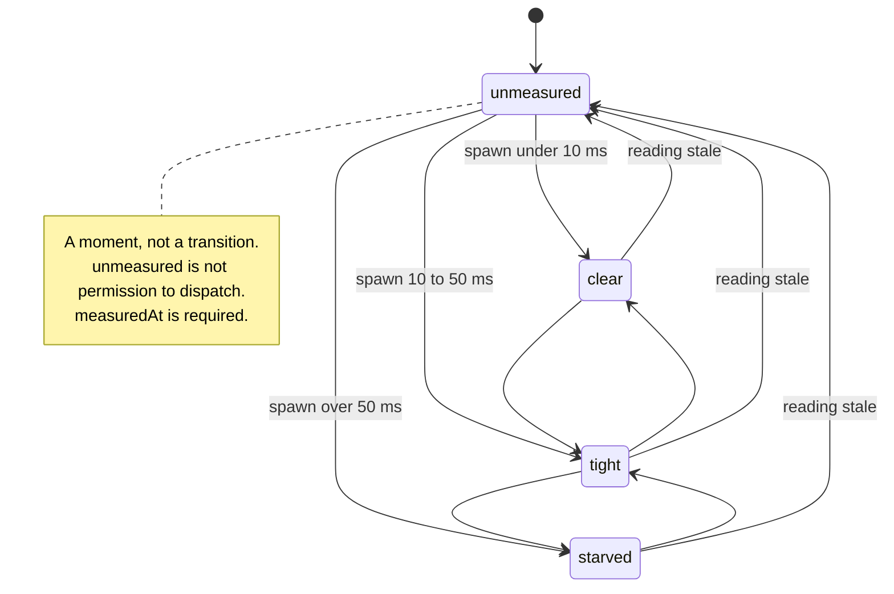
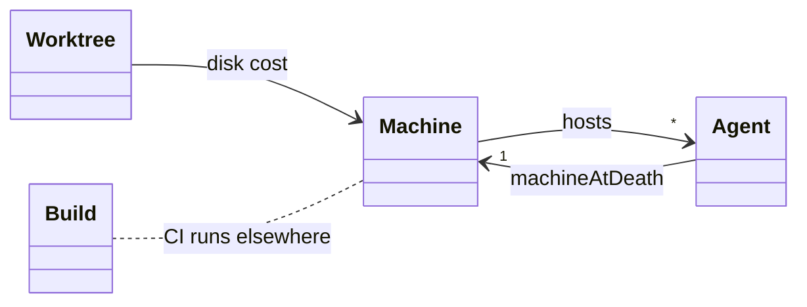

# Machine — domain object specification

The resource every other entity competes for, and the only one whose absence
made four diagnoses wrong.

> **Story:** [The master agent holds the fleet](STORY-the-master-agent-holds-the-fleet.md)
>
> **Companions:** [Entities](DESIGN-entities.md) · [Agent](DESIGN-agent.md) ·
> [Worktree](DESIGN-worktree.md) · [Build](DESIGN-build.md) ·
> [Budget](DESIGN-budget.md)

## Contents

| § | section | answers |
|---|---|---|
| 1 | [What a Machine is](#1-what-a-machine-is) | why it must exist |
| 2 | [Posture](#2-posture) | none — it is the hardware |
| 3 | [The domain object](#3-the-domain-object) | **the normative spec** |
| 4 | [Lifecycle](#4-lifecycle) | a state that is a moment |
| 5 | [Direction](#5-direction) | none |
| 6 | [Relations](#6-relations) | Agent · Worktree · everything |
| 7 | [Actions](#7-actions) | measure — and nothing else |
| 8 | [Scope](#8-scope) | one machine, and what shares it |
| 9 | [The collaborators](#9-the-collaborators) | a Monitor, and why not a Manager |
| 10 | [Fleet control](#10-fleet-control) | the ceiling on the operator's dial |
| 11 | [Views](#11-views) | headroom beside the stepper |
| 12 | [Setup](#12-setup) | none |
| 13 | [Gaps](#13-gaps) | it does not exist |
| 14 | [Invariants and open points](#14-invariants-and-open-points) | |

---

## 1. What a Machine is

**A Machine is the resource every other entity competes for**, and nothing
models it.

**So its symptoms land on whatever entity *is* modelled**, which is the whole
reason it must exist:

| what happened | what it was blamed on | what it was |
|---|---|---|
| **7 workers died `exit 124`** | a Plot defect, four times | **machine starvation** |
| the board went dark, **3×** | a test leak, worker count | competing load |
| spawn cost 3.6 → 286 ms | Homebrew git's signature | starvation, a symptom |
| `episodic-memory` at 12.3/16 cores | the driver | a finite indexing burst |

**`exit 124` is `timeout`'s signal.** It means *the clock ran out* — and with no
Machine entity, the only available reading is *the worker stopped*. Those are
opposite conclusions: one says restart on a quieter machine, the other says the
work is broken.

**This is the same defect as `state: CLOSED` on a merged PR** — a value honest
about its own source and misleading about the question actually being asked. The
fix is the same: model the thing the value is really about.

---

## 2. Posture

**None.** A Machine is hardware. No tracker, no host, no config changes what it
is — and it is the only entity here whose truth is neither git, a file, a host
nor a process, but **the operating system**.

---

## 3. The domain object

> **Identity: none.** There is exactly one Machine, and that singularity is
> load-bearing — with two, headroom would be a property of a *pair*. It is the
> one entity outside the [three kinds](DESIGN-review.md#1-identity-three-kinds).
> **State: MEASURED** — the fourth
> [source](DESIGN-review.md#2-state-where-each-entitys-truth-lives), and the only
> one that **decays instantly**: the next process anyone starts invalidates it,
> which is why a reading carries `measuredAt`.


### Identity

**A Machine has no identity, because there is exactly one.** Everything in this
design runs on the machine it is measured from — the board, the agents, the
scan, the supervisor.

**That singularity is load-bearing** (§8): if there were two, headroom would be
a property of a *pair* and the whole entity would need a key.

### Fields

| field | type | note |
|---|---|---|
| `spawnCostMs` | number \| null | **the signal** — null when unmeasured |
| `headroom` | `clear`\|`tight`\|`starved`\|`unmeasured` | derived from it |
| `measuredAt` | ISO-8601 | **required** — a reading without one cannot be judged stale |
| `sampleMs` | number | **what the measurement itself cost** |
| `loadAverage` | [1m, 5m, 15m] | **context only, never the verdict** |
| `cores` | number | context |

### Why spawn cost, and not load average

**Load average was tried and misled.** *"Five workers ran fine at load 10 on one
occasion and starved the machine at load 8 on another, because the variable was
**what else was spawning**, not the count."*

**Spawn cost separated every good state from every bad one**, and it does so
because it measures the thing Plot actually does: fork a process. A fleet is
thousands of `git rev-parse` calls, so the cost of one is the cost of everything.

**Measured 2026-08-28, three consecutive runs:**

```
3.8 ms   3.6 ms   3.6 ms        ← clear, and reproducible
```

against the story's starved reading of **286 ms** — a **79× swing** on the same
hardware.

### The observer must price itself

**`sampleMs` is not decoration.** A headroom measurement that costs meaningfully
under load makes the observer part of the problem — which is the story's own
complaint, restated as a constraint on its fix.

**Measured: 374 ms for 100 spawns**, against a fleet scan at **18.3 s**. So one
reading costs **2% of one scan**, and a reading per pulse is affordable where a
second scan would not be.

---

## 4. Lifecycle

### The state is a moment, not a transition

| headroom | spawn cost | means |
|---|---|---|
| `clear` | **< ~10 ms** | dispatch freely |
| `tight` | ~10–50 ms | finish what is running; do not add |
| `starved` | **> ~50 ms** | **the operator's board is already suffering** |
| `unmeasured` | — | not asked, or the measurement failed |

Source: [`diagrams/machine-lifecycle.mmd`](diagrams/machine-lifecycle.mmd)



**The thresholds are provisional and must be re-measured.** They come from one
session — one sample — and this document says so rather than presenting them as
settled.

### It decays without anyone touching anything

**Machine is the second entity with that property** (Branch §4 is the other),
and it decays faster: a Branch's state goes stale at the next push, a Machine's
at the next process anyone starts.

**So `measuredAt` is required, not optional.** A headroom value without its
timestamp is a snapshot without a date — precisely the mistake made when reading
a `--no-fetch` scan as authoritative (Branch §4).

---

## 5. Direction

**None.** Nothing outside creates or consumes a Machine; it is observed and
never written.

---

## 6. Relations

| relation | mechanism |
|---|---|
| Machine → **everything** | every entity's derivation runs on it |
| Agent → Machine **at death** | `machineAtDeath` (Agent §3) |
| Worktree → Machine | disk, and a recursive tool's cost (Worktree §12) |
| Build → Machine | **no** — CI runs elsewhere |

Source: [`diagrams/machine-relations.mmd`](diagrams/machine-relations.mmd)



**`machineAtDeath` is the relation that matters**, and it is why the
`AgentMonitor` must be attached at creation (Agent §9): *a scan finding a dead
worker cannot know what the machine was like when it died.*

**Build is the one entity that does not share it** — CI runs on the host's
hardware, which is why a red build says nothing about local headroom.

---

## 7. Actions

**One: measure.** And explicitly **not**:

| not | why |
|---|---|
| kill an agent | never Plot's call |
| throttle the fleet | the operator's dial, not the controller's |

**Amended 2026-08-30: it also provides, and at `starved` it defers.** *"Refuse a
dispatch"* stood here until a distinction was drawn that this row had collapsed:
**refusing ends the dispatch, deferring postpones it.** The machine now provides
the worker and says *not yet* while it is starved, with the number it measured;
the operator may proceed anyway. See §10 for the argument and the exact
boundary. The other two rows are unchanged and are not weakened by it — a
deferral spends nothing the operator owns, while a kill and a throttle both do.

**The controller may throttle *itself*** — its own cadences, its own metered
fetches, its own test runs — because that spends nothing the operator owns
(entities §Elastic).

---

## 8. Scope

**One machine, and the supervisor is on it.**

**That is the story's central coupling:** *"the board polls a scan that spawns
115 git processes every 5 seconds. A supervisor working on the same machine is
not a neutral observer — it is a competing load, and three times it took the
operator's own view away."*

**What shares it**, measured across this session: the board, 13 agents, the
scan, the supervisor's own tool calls, and everything else on the laptop —
including an indexing burst that held 12.3 of 16 cores.

**Which is why the entity is singular** (§3): headroom is not *this fleet's*
headroom, it is *the machine's*, and the fleet is one tenant among several.

---

## 9. The collaborators

### `MachineMonitor` — one, and there is no Manager

**Unlike Agent and Worktree, Machine needs no manager**, because there is
nothing to own: no creation, no removal, no pairing. Plot does not manage
hardware.

**What it needs is a monitor**, and the difference from the others is scope:

| monitor | watches | stops when |
|---|---|---|
| `AgentMonitor` | one agent | that agent exits |
| `WorktreeMonitor` | one tree | its agent is gone |
| **`MachineMonitor`** | **the machine** | **never — there is one, and it is always there** |

**A single long-lived reading**, sampled on a cadence and shared by every
consumer — not one per agent, which would multiply the very cost it measures.

### What it must supply

| to | what |
|---|---|
| the **board** | headroom beside the `parallelAgents` stepper (§11) |
| the **master agent** | *can I start work right now?* (job 1) |
| the **AgentMonitor** | the reading at an agent's exit — `machineAtDeath` |

---

## 10. Fleet control

**Machine's job is the ceiling on a control that already exists.**

`fleetControls.parallelAgents` ships with `MIN_PARALLEL_AGENTS = 1` and **no
maximum** — so the stepper climbs forever with nothing saying where the
machine's range ends.

| what the operator sees | source |
|---|---|
| the dial, at 3 | `parallelAgents` — **exists** |
| slots taken | `liveAgentCount` — **exists** |
| **what the machine can take** | **Machine — does not exist** |

**It bounds, and at `starved` it says *not yet*.** Elastic means *the operator
scales within a range the machine can take* — the controller reports the range
and a person chooses inside it.

#### Superseded the same day: there is nothing to refuse

**Operator decision, 2026-08-30, and it dissolves the question above rather than
answering it.** The deferral below was designed for a dispatch arriving while the
machine is starved. In the shape settled that day, that request never arrives.

**A first version of this had the machine start idle workers for agents to
claim. It was withdrawn** — a worker is a *relation*, the process an agent runs
on a machine, so an idle worker with no agent is not unpaired but absent
(`DESIGN-agent.md` §*Agent and Worker are one entity*). **No new object is
needed.**

```
the operator asks the REGISTRY for N agents
    → the registry SPAWNS each agent; spawning it IS starting its process
    → that process is the worker. Nothing can start a worker on its own
the agents work, and the machine comes under pressure from what they DO
    → not from a request arriving at it
a dispatch goes to a FREE agent — running, between units, holding no slice
    → so a dispatch never asks the machine for capacity
```

**"No free agent" is a count, not a prediction.** That is what dissolves the
argument below: *headroom is a forecast and a forecast does not earn a refusal*
is true, and irrelevant to counting. `0 free` is the same kind of fact as *this
branch is claimed* — already the whole of Plot's locking:

> *"The push is the claim, and it is the whole locking mechanism"*
> — `DESIGN-branch.md` §the claim

**So the machine neither refuses nor defers.** It measures the pressure the
agents create and reports it; the operator reads that when choosing N. The
decision moves to a moment where a person is already deciding, which is where §7
always wanted it — and `starved` becomes what it was designed to be in §5: a
reading, shown to whoever sets the dial.

**`DESIGN-agent.md` already had the missing half.** Availability is defined
there, separated from the eight process states, and derived rather than stored.
What neither spec said is that **a dispatch looks at it** — which is why this
one spent two revisions arguing about predicting capacity while the other was
already counting it.

**Revised 2026-08-30.** This section read *"it bounds; it never refuses"* and
grounded that on a real distinction: **Plot's gates refuse on measurements of
harm already done** — a live pid, an unmerged branch — whereas **headroom was
called a prediction about capacity**, which does not earn a refusal.

**Two things break that reading.**

**First, `starved` is not a prediction.** §5 chose spawn cost over load average
precisely because it *measures the thing Plot does*: fork a process. The reading
is `3.6 ms` clear against `286 ms` starved — a 79× swing on the same hardware,
taken now, not extrapolated. A machine that cannot fork cheaply **is** harmed,
in the same sense a live pid is a fact rather than a forecast.

**Second, deferring is not refusing.** The three forbidden actions in §7 share
one shape: each takes something away from the operator permanently — a dispatch
that will not happen, an agent that is dead, a fleet held below what was asked.
**"Not yet" takes nothing away.** The dispatch stands, the dial keeps its value,
and the work starts when the reading clears. The operator can always say *now
anyway* — and that is what keeps this a deferral rather than a veto.

**What the machine may therefore do**, and only this:

| at | the machine |
|---|---|
| `clear` / `tight` | provides the worker |
| `starved` | **says *not yet*, and says what it measured** |
| any reading | never kills an agent, never moves the dial |

**The refusal must name its number.** *"Not yet: spawn cost 286 ms against a
clear reading of 3.6 ms"* is answerable; *"too much load"* is not, and load
average is explicitly not the verdict (§5).

**This does not license refusing on a stale reading.** `measuredAt` is required
for exactly this reason: a `starved` reading nobody can date is `unmeasured`,
and `unmeasured` provides the worker. Silence is never a refusal.

---

## 11. Views

| view | shows |
|---|---|
| beside the stepper | *room for more* · *at the edge* · *the board is suffering* |
| an agent's death | `machineAtDeath`, so `exit 124` names its cause |

**`unmeasured` renders as *capacity unknown*, never as room** — absent is not
false, applied to headroom.

---

## 12. Setup

**None.** There is nothing to configure: no path, no host, no credential. The
thresholds (§4) are the only tunable, and they are provisional enough that
hard-coding them and re-measuring is more honest than a key nobody could set
correctly.

---

## 13. Gaps

**The entity does not exist.** Every row below is *unbuilt*, not *broken*.

| # | gap |
|---|---|
| 1 | **No Machine entity at all** — its symptoms land on Agent, and did four times |
| 2 | **No `machineAtDeath`** — `exit 124` cannot name its cause |
| 3 | **No ceiling on `parallelAgents`** — floor 1, no maximum |
| 4 | **Nothing prices an operation before it runs** — job 4 |

---

## 14. Invariants and open points

### Invariants

1. **Measured, never inferred** — load average is context, spawn cost is the
   verdict.
2. **A reading has a timestamp**, and goes stale faster than any other entity's.
3. **The observer prices itself** — 374 ms against an 18.3 s scan.
4. **It defers, and never refuses** — at `starved` it says *not yet* with the
   number it measured; the operator may proceed anyway. It bounds a dial only
   the operator moves, and it never takes a dispatch away (§7, §10).
5. **There is exactly one**, and the fleet is one tenant on it.
6. **The controller may throttle itself; only the operator resizes the fleet.**

### Open points

- **Are the thresholds right?** One session, one sample. They should be
  re-measured across machines before anything renders them as advice.
- **Is spawn cost the right signal or a proxy?** It separated every observed
  good and bad state, which is evidence, not proof — it may stand in for I/O
  wait, memory pressure, or `syspolicyd` queue depth.
