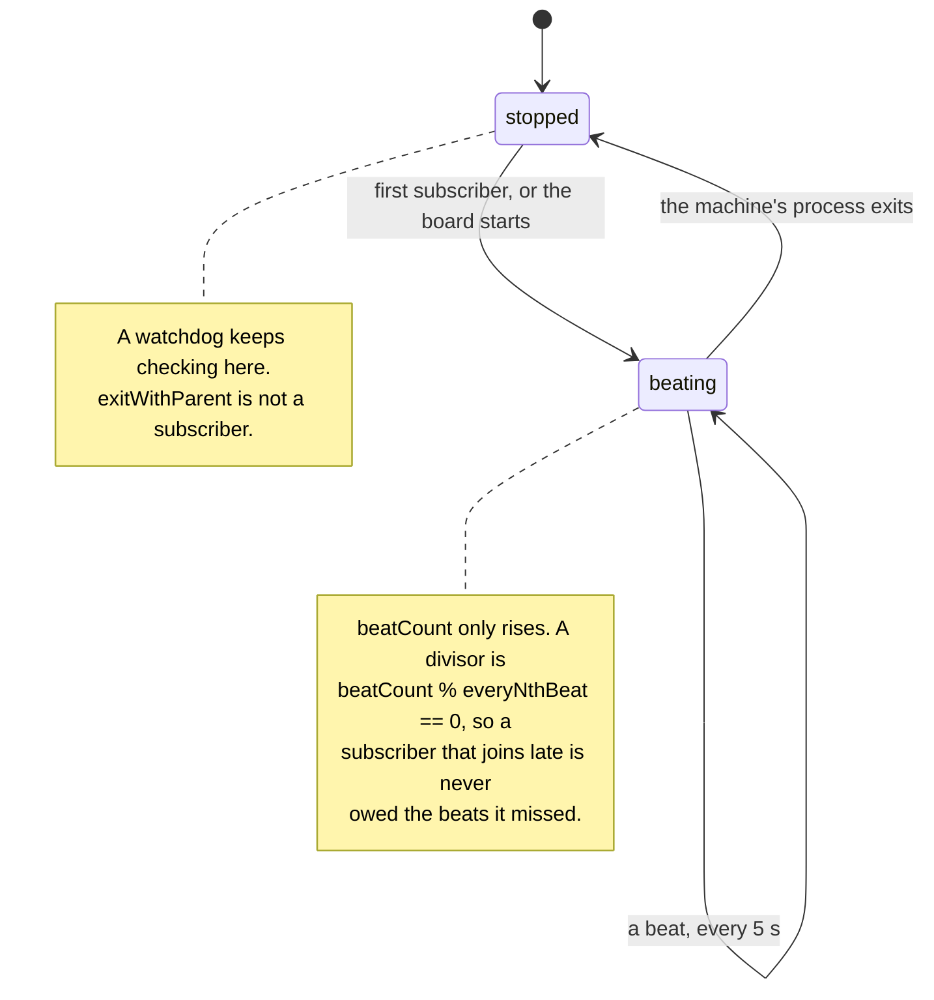
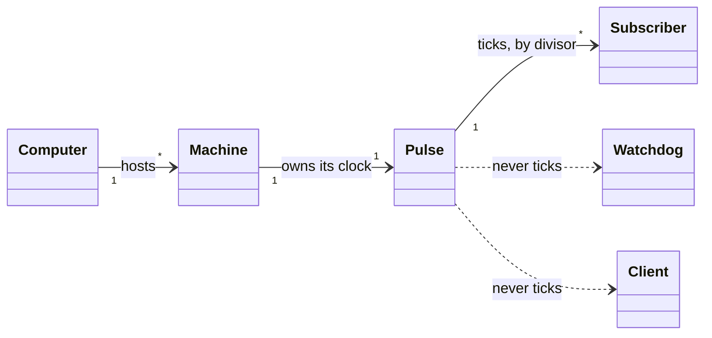

# Pulse — domain object specification

A machine's clock: it beats once, and every subscriber names how many beats it
waits.

> **Story:** [The master agent holds the fleet](STORY-the-master-agent-holds-the-fleet.md)
>
> **Companions:** [Entities](DESIGN-entities.md) · [Machine](DESIGN-machine.md) ·
> [Agent](DESIGN-agent.md) · [Ports and adapters](DESIGN-ports.md)

## Contents

| § | section | answers |
|---|---|---|
| 1 | [What a Pulse is](#1-what-a-pulse-is) | why a clock is an entity |
| 2 | [Posture](#2-posture) | none — it counts |
| 3 | [The domain object](#3-the-domain-object) | **the normative spec** |
| 4 | [Lifecycle](#4-lifecycle) | beating, and stopped |
| 5 | [Direction](#5-direction) | outbound only |
| 6 | [Relations](#6-relations) | Machine · Subscriber · and two non-relations |
| 7 | [Actions](#7-actions) | beat · subscribe — and never wait |
| 8 | [Scope](#8-scope) | **what the pulse does not tick** |
| 9 | [The collaborators](#9-the-collaborators) | the subscribers, and no manager |
| 10 | [Fleet control](#10-fleet-control) | the cadence is not a dial |
| 11 | [Views](#11-views) | mostly invisible, and that is correct |
| 12 | [Setup](#12-setup) | none |
| 13 | [Gaps](#13-gaps) | the entity does not exist |
| 14 | [Invariants and open points](#14-invariants-and-open-points) | |

---

## 1. What a Pulse is

**A Pulse is the clock a Machine beats on, and everything that actively polls
counts its beats.** It is not a setting and not a number: it is a thing that
exists on a machine, can be observed there, and stops when that machine's
process does.

**The operator named it, 2026-08-30:**

> *The pulse is a core domain concept, which basically is the **master clock**
> in our system. This cannot be part of the board. **This thing runs on a
> machine.** The pulse is the clock that starts ticking for everything actively
> polling.*

### The story defined five entities and left out their clock

`Machine`, `Agent`, `Slice`, `Worktree`, `Plan` — each has a specification, and
none of them says when anything happens. The domain exports a type and a schema
for what the scan *produces*; the beat itself is a `setInterval` inside the
board ([`fleet.ts:2447`](../../../packages/board/src/server/fleet.ts)).

**So the cadence lives where it can neither be reasoned about nor reused.** A
supervisor outside the board that wants to know *when to look again* has nothing
to ask, and builds its own timer — which is how three cadences came to be chosen
in two languages by three authors.

### The three cadences are already one clock

Measured 2026-08-30, re-verified 2026-09-01:

```
pulse          5 s    1x     fleet.ts:65
monitor       30 s    6x     plot-worker-monitor.sh:165
PR refresh    60 s   12x     fleet.ts:81      (2x monitor)

30 % 5 = 0     60 % 5 = 0     60 % 30 = 0
```

**Every remainder is zero**, across three numbers nobody coordinated. That is
the evidence the entity already exists implicitly: three independent authors
picked multiples of one base because the base is what the work actually has.

**A clock needs no frequencies.** It beats once, and each subscriber says how
many beats it waits. Three timers become one timer and three integers.

### Why that is better than three timers

| | three timers | one clock, three divisors |
|---|---|---|
| where the cadence lives | three files, two languages | one entity |
| *are they related?* | unanswerable — you compare constants | `6` and `12` say it |
| a fourth poller | invents a fourth number | names a divisor against a known base |
| retuning the base | edit three constants and hope | one number moves; the ratios hold |

**The last row is the one that pays.** The ratios are the design; the base is a
guess from one session. A divisor model lets the guess be corrected without
re-deriving the design.

---

## 2. Posture

**None.** A pulse counts. No tracker, no host, no git, no config changes what a
beat is — it is the only entity here whose truth is neither a file, a ref, a
host nor a process, but **elapsed time on the machine it runs on**.

**It has no `Review:`, no `Impl:`, no backend.** `DESIGN-ports.md`'s adapters
answer *where does this fact come from*; a beat comes from nowhere, which is why
its port (§9) is a scheduler and not a reader.

---

## 3. The domain object

> **Identity: its Machine's.** A pulse is not addressable on its own — there is
> exactly one per Machine (§8), so naming the machine names the clock. It is the
> only entity here that borrows its whole identity from its owner.
> **State: COUNTED.** Not read from git, a host, a file or the process table.
> `beatCount` is the state, it only rises, and it is not persisted: a restart
> starts at zero, and nothing is owed for the beats that did not happen.

### Fields

| field | type | note |
|---|---|---|
| `machine` | `MachineId` | **the identity** — `hostname/shortId` (Machine §3) |
| `intervalMs` | number | the base. `5_000` today ([`fleet.ts:65`](../../../packages/board/src/server/fleet.ts)) |
| `beatCount` | number | **monotonic, from 0** — the divisor's operand |
| `startedAt` | ISO-8601 | when this clock began; a restart resets it |
| `subscribers` | `Subscriber[]` | who is counting, and by what |

### A subscriber names a divisor, not a frequency

```ts
interface Subscriber {
  /** Who, for the log. */
  name: string;
  /** How many beats between runs. 1 = every beat. Must be >= 1. */
  everyNthBeat: number;
  /** What to run. Its failure is contained (§7). */
  tick: () => void;
}
```

A subscriber runs when `beatCount % everyNthBeat === 0`. Today's three:

| subscriber | divisor | effective | source |
|---|---|---|---|
| the fleet scan | **1** | 5 s | [`fleet.ts:2447`](../../../packages/board/src/server/fleet.ts) |
| a worker monitor | **6** | 30 s | [`plot-worker-monitor.sh:165`](../../../skills/plot/scripts/plot-worker-monitor.sh) |
| the PR reader | **12** | 60 s | [`fleet.ts:2452`](../../../packages/board/src/server/fleet.ts) |

**The divisors are derived, not configured.** They are today's seconds divided by
today's base. Move the base and they move with it — which is the point of
recording them as ratios rather than as durations.

#### The divisor preserves each subscriber's own argument

**This is the reason the model is divisors and not one shared frequency.** Each
number was chosen for a stated reason, and a divisor keeps the reason attached
to the subscriber that holds it.

**The monitor holds 30 s because two samples 0.4 s apart measure noise:**

> *a CPU delta over two samples 0.4 s apart says whether a process is busy now,
> which is noise on its own*

**The PR reader holds 60 s because the host is metered.**
[`fleet.ts:67-80`](../../../packages/board/src/server/fleet.ts) records what it
cost to learn:

> *Firing both on the 5 s timer meant 720 host calls an hour, which exhausts a
> 5000/hour budget in under a working day — and did, on 2026-08-16, mid-plan
> (`remaining 0/5000, used 5007`).*

**One frequency destroys both arguments; a divisor destroys neither.** A shared
5 s would re-spend the budget that outage cost; a shared 60 s would make git
freshness — the thing that is local and free — twelve times worse for nothing.

### `beatCount` is monotonic, and nothing is owed

**A subscriber that joins at beat 400 with divisor 6 waits until 402.** It is not
run immediately, and it is not run six times to catch up.

**Catch-up would be wrong for every current subscriber.** All three ask *what is
true now* — the estate, the process table, the host's PR state. A missed poll has
no backlog, because the next poll answers the same question with fresher data.
**Replaying a clock's missed beats replays questions whose answers have already
changed.**

**And a late-joining subscriber must not be able to trigger a scan.** With
catch-up, subscribing would run an 18.3 s scan at an unpredictable moment; without
it, the cost of a new subscriber is bounded by the divisor it declared.

---

## 4. Lifecycle

**Two states, and the transition is not interesting.** This is the simplest
lifecycle in the design, and the document says so rather than inventing stages.

| state | means |
|---|---|
| `stopped` | no timer. Nothing is ticked; watchdogs keep running (§8) |
| `beating` | the timer runs; every `intervalMs`, `beatCount` rises by one |

Source: [`diagrams/pulse-lifecycle.mmd`](diagrams/pulse-lifecycle.mmd)



### It dies with its machine's process, and that is a feature

**A pulse is not a daemon.** It has no pid file, no restart, nothing that
outlives the process that made it. `fleet.ts:2448` calls `timer.unref()`, which
states the same property in code: **the clock must never be the reason a process
stays alive.**

**The consequence is the exclusion in §8 that matters most.** Anything whose job
is to notice the machine going away cannot be ticked by the machine's own clock.

### There is no `paused`

**Not chosen, and the reason is the failure model.** A pause is a state one
subscriber could put the others in — precisely the coupling §7 exists to
prevent. A subscriber that wants to stop counting unsubscribes; the clock keeps
beating for everyone else.

---

## 5. Direction

**Outbound only.** The pulse sends and never receives. Nothing tells it what
time it is, nothing asks it to beat, and no subscriber's result comes back to
it.

**That is what stops it becoming a service** (§7).

---

## 6. Relations

| relation | mechanism |
|---|---|
| **Machine → Pulse** | **one machine, one clock** — the machine owns it (§8) |
| Computer → Pulse | **none directly** — via its machines; three instances are three clocks |
| Pulse → Subscriber | ticks it, when the divisor comes up |
| Pulse → **Watchdog** | **never** — §8 |
| Pulse → **the browser client** | **never** — §8 |
| Agent → Pulse | it does not hold one; its monitors subscribe on its behalf |

Source: [`diagrams/pulse-relations.mmd`](diagrams/pulse-relations.mmd)



**The two dotted edges are drawn deliberately.** They are the document's most
re-litigable claims (§8), and an absent edge reads as an oversight where a dotted
one reads as a decision.

---

## 7. Actions

**Two: beat, and subscribe.** And explicitly **not**:

| not | why |
|---|---|
| **be asked *"has it beaten?"*** | a clock that is polled is a poll with extra steps |
| **wait for a subscriber** | one slow subscriber would set everyone's cadence |
| **retry a subscriber** | the next beat is the retry, and it is already scheduled |
| **report a subscriber's result** | results flow to whoever asked for them, never back |

### A failing subscriber cannot delay another's beat

**This is a requirement, not a quality.** `fleet.ts:2449` records why the two
timers were split in the first place:

> *Its own timer, because its own clock: git is local and free at 5 s, the host
> is metered and pointless below a minute. **They failed independently already;
> now they also fire independently.***

**A shared clock that re-couples them makes this design a regression.** The
split was introduced to fix a real failure; merging the timers without
preserving isolation would reintroduce it while claiming to be an improvement.

**So the beat dispatches and does not await.** A subscriber that throws is caught
and logged at the pulse; a subscriber that hangs holds only itself. Concretely:

- **the pulse never `await`s a `tick`** — an async subscriber's promise is
  detached, and its rejection is handled where it is detached
- **a throw is caught per subscriber**, not per beat. One that throws on every
  beat is a subscriber with a bug, not a stopped clock
- **a subscriber still running when its next turn arrives skips that turn.**
  Its own re-entrancy is its own concern — today `fleet.ts` guards exactly this
  with `running` and `prRunning` flags ([`fleet.ts:639-641`](../../../packages/board/src/server/fleet.ts))

**The last point is where the isolation is most easily lost.** A pulse that
queued the skipped turn would convert one slow subscriber into an ever-growing
backlog — the coupling again, arriving as a helpful feature.

---

## 8. Scope

**One pulse per Machine, where a Machine is a Plot instance** — and the
exclusions below are the part of this document a later reader will try to undo.
**Each carries its own reason, not a cross-reference.**

### One machine, one pulse; several machines, one computer

**Three Plot projects on this computer are three machines**, each with its own
pulse over its own estate. Measured 2026-08-30, re-measured 2026-09-01, each
verified for a `## Plot Config` section *and* a `.plot/` directory:

```
Agentic-Tools/plot          Plot Config: yes    .plot/: yes
Agentic-Tools/agent-skills  Plot Config: yes    .plot/: yes
EKZ.Webportal/ekzweb        Plot Config: yes    .plot/: yes

hostname:  ani              — the same string for all three
```

**The identity already exists in the code.**
[`fleet.ts:646`](../../../packages/board/src/server/fleet.ts) keys every cache —
and therefore every pulse and every PR timer — by
`` `${opts.repoRoot}\0${opts.scriptsDir}` ``. **That key is the machine's
identity** (Machine §3), so the timer pair it creates per repository is one clock
per machine and not a defect.

**A first reading of that key called it an artefact to remove.** It is not: three
instances on one laptop must not share a clock, because they have different
estates and different loads.

### Which measurements belong to which

| | **the instance** (Machine) | **the computer** (hardware) |
|---|---|---|
| `intervalMs`, the divisors | **yes** — this clock's | no |
| `beatCount`, `startedAt` | **yes** | no |
| `spawnCostMs`, `loadAverage`, `cores` | no — it *reads* them | **yes** |
| `hostname()` | insufficient — returns `ani` for all three | its name |

**Three instances measuring one spawn cost is three tenants reading one meter**,
not three measurements. The divisors are the instance's; the headroom they run
against is the computer's, shared with every other instance and with everything
else on the laptop.

### The test suite is proof that several are legitimate

**Suites start boards with `PORT=0` in parallel**, each over its own fixture
estate. Every one is a Machine by the definition above — its own `repoRoot`, its
own clock — and none of them is a mistake.

**So a guard refusing a second pulse on one computer would enforce a rule that
was never the rule.** The invariant is *one per machine*, and the suite is the
standing counter-example to any stronger reading of it.

### What the pulse does NOT tick

#### Watchdogs — a watchdog that dies with its subject is not one

`exitWithParent`
([`lifetime.ts:100`](../../../packages/board/src/server/lifetime.ts)) checks
whether **its own parent** is still alive, every
`PARENT_CHECK_INTERVAL_MS = 1000` ([`lifetime.ts:73`](../../../packages/board/src/server/lifetime.ts)).

**Its subject is the process the pulse lives in.** A watchdog ticked by that
process's clock stops exactly when the thing it watches goes wrong — so the one
case it exists for is the one case it cannot report. **The independence is the
whole mechanism**, and 1 s is deliberately not a multiple of 5 s.

**This is not a candidate for a divisor of 1/5.** A divisor makes it a
subscriber, and a subscriber is what it must never be.

#### The browser client — ticking it makes the pulse an API

`App.tsx` polls at `FLEET_POLL_MS = 4_000`
([`App.tsx:30`](../../../packages/board/src/app/App.tsx)) — **not a multiple of
5 s**, and deliberately faster than the server so it never sits a whole beat
behind an update it could have shown.

**It runs in another process, and often on another machine.** Ticking it means
sending beats over the wire, which turns a clock into a protocol: reconnection,
ordering, backpressure, and a client that can be *behind* rather than merely
polling. **The clock stays inside one process boundary; the client keeps its own
timer.**

**Its 4 s is not an error to be rounded to 5.** The client polls a cache the
server fills; polling slightly faster than the fill costs one cheap local request
and guarantees no beat's result waits a full extra cycle to be seen.

#### Monitors — tickable now, and this document does not tick them

**The process-tree framing was tried and does not survive measurement.** A
monitor runs inside its worker's wrapper; the pulse runs inside the board.
**They have never shared a parent.** Measured 2026-08-30: 32 monitor processes
alive, every one `ppid=1`, and **no board process running at all**.

**So "the pulse's own process tree" is the wrong boundary.** The right one is
narrower: **the pulse ticks subscribers that can receive a tick.**

**A channel now exists** — `adapters/channel/channel-socket.ts` shipped in #584,
and `entities/subscription.ts` carries the `Purpose` a subscriber opens with. So
the blocker recorded in an earlier draft is gone, and monitors are tickable.

**They are still not ticked by this document, for a reason that is not
technical.** Today `plot-dispatch.sh:558` states the property their placement
buys:

> EVERY WORKER IS BORN MONITORED, AND THAT IS ENFORCED HERE OR NOWHERE.
> Three monitors start INSIDE the wrapper, as its children, immediately before
> the agent.

**A pulse-ticked monitor is machine-scoped, so it cannot be a child of the worker
it watches** — and the birth guarantee moves from a wrapper that *cannot* forget
to a registry that *can*. **Whatever replaces it has to be a gate, not a rule**
(CLAUDE.md, *Gates Over Rules*), and that gate is
`the-registry-supervises-its-agents`'s subject.

**So the exclusion is a sequencing decision with a named owner**, not a
limitation of the clock.

#### The existing channel is a subscription to findings, not to beats

**Recorded so the next reader does not assume the mechanism is already there.**
`PurposeSchema` (`entities/subscription.ts`) admits `everything` or `until` a
named finding — **a subscription to things that happen**, served when a monitor
publishes. A divisor subscription is to **nothing happening on a schedule**.

**Both are subscriptions and neither is the other.** Ticking monitors over the
channel needs a beat message that `Purpose` does not currently express, which is
work the Ticking slice owns.

---

## 9. The collaborators

### The subscribers, and there is no manager

**Unlike Agent and Worktree, Pulse needs no manager.** There is nothing to own:
no creation to arbitrate, no removal to sequence, no pairing to maintain. A
subscriber adds itself and removes itself.

**And no monitor.** A pulse that needed watching would need a second clock to
watch it with, and that clock would need a third. **The watchdog is the answer to
"is this process alive"**, and it is deliberately not a subscriber (§8).

### The port is a scheduler, not a reader

**Every other entity's port answers *where does this fact come from*.** A beat
comes from nowhere — it is elapsed time — so the pulse's port is the one thing
the domain cannot compute: `setTimeout`/`setInterval`.

```
domain  →  ports/clock.ts   (schedule, cancel, now)
              ↑
           adapters/clock-system.ts   (setInterval, Date.now)
```

**That is what makes the divisor model testable without waiting.** A fake clock
advances 12 beats in no time and asserts the PR reader ran once and the scan
twelve times — the assertion the Ticking slice needs, and one that a real 60 s
timer could only make slowly and flakily.

**It follows the layering rule unchanged** (CLAUDE.md): the domain owns the
interface, the adapter reaches the world, the dependency points inward.

### What it must supply

| to | what |
|---|---|
| the **scan** | a beat, every beat |
| the **PR reader** | a beat every twelfth, so the budget holds |
| a **monitor** | a beat every sixth, once the channel carries beats (§8) |
| the **master agent** | *the machine is still counting* — a clock that stopped is a fleet nobody is watching |

---

## 10. Fleet control

**The cadence is not a dial, and this document does not retune it.**

**`parallelAgents` is the operator's control** (Machine §10). The pulse has no
equivalent: nothing about 5 / 30 / 60 is presented to a person, and nothing
should be until the numbers have been measured more than once.

| what | today | whose |
|---|---|---|
| the base, 5 s | a constant | **a guess from one session** |
| the divisors, 1 / 6 / 12 | three constants in two languages | **derived from the base** |
| what a person can change | **nothing** | — |

### It may throttle itself, and only itself

**`DESIGN-entities.md` §Elastic settles the boundary**, and it applies here
directly: the controller may throttle its own cadences, because that spends
nothing the operator owns. It may not shed the operator's work.

**And the same section records the mistake to avoid.** An earlier draft had the
controller drop to *"pulse only"* at `starved` — a judgement it may not make,
corrected 2026-08-28. **The pulse reports its beat; the operator sets the fleet's
size.**

### Not chosen: move the cadence in this plan

**Changing 5 / 30 / 60 is a behaviour change with its own risk**, and each number
carries a measurement that would have to be re-taken. **This document gives the
numbers one owner; it does not retune them.**

---

## 11. Views

**Almost nothing, and that is correct.** A clock working looks exactly like a
clock nobody modelled. The board already shows what the beats *produce* — the
estate, the agent rows, the PR chips — and none of that improves by naming the
beat that fetched it.

| view | shows | why |
|---|---|---|
| the tab's own poll indicator | seconds since the client's last fetch — **exists** | the client's clock, not this one |
| **a stopped pulse** | **nothing today** | §13, gap 3 |

**A stopped pulse is the one state worth rendering**, and it is the one the board
cannot currently distinguish from a slow scan: both look like data that is not
getting newer. **`beatCount` and `startedAt` are what make that renderable** —
a count that stopped rising is a stopped clock, and a count that never started is
a machine that never began.

---

## 12. Setup

**None.** There is nothing to configure: no path, no host, no credential, no key.

**`intervalMs` is deliberately not a config key.** It is one number, derived from
one session's measurement, and every divisor in the design is expressed against
it. **A key nobody could set correctly is worse than a constant that can be
re-measured** — the same argument Machine §12 makes for its thresholds.

---

## 13. Gaps

**The entity does not exist.** Every row is *unbuilt*, not *broken*.

| # | gap |
|---|---|
| 1 | **No Pulse entity** — the beat is a `setInterval` in the board ([`fleet.ts:2447`](../../../packages/board/src/server/fleet.ts)), reachable only from inside it |
| 2 | **No subscribers** — two timers, hard-wired to two functions. Nothing can join |
| 3 | **Nothing reports a stopped clock** — a board whose timer died looks like a board whose scan is slow (§11) |
| 4 | **No clock port** — the domain cannot schedule, so a divisor cannot be unit-tested without waiting (§9) |
| 5 | **The divisors are not written down anywhere but here** — 6 and 12 exist as `30` and `60_000`, in two languages, related only by arithmetic a reader has to do |
| 6 | **Monitors cannot be ticked** — the channel exists, a beat message does not (§8) |

---

## 14. Invariants and open points

### Invariants

1. **One pulse per Machine, and a Machine is a Plot instance.** Several machines
   per computer; the parallel test suite is the standing proof that this is
   legitimate and not a leak (§8).
2. **The pulse beats; it is never asked.** A clock that answers *"has it beaten
   yet?"* is a poll with extra steps (§7).
3. **A subscriber's failure is its own.** A throw, a hang or a rate limit cannot
   delay, skip or queue another subscriber's beat — the isolation the split
   timers already bought, which a shared clock must not spend (§7).
4. **Subscribers name divisors, not durations.** The base may be re-measured; the
   ratios are the design (§3).
5. **`beatCount` only rises, and nothing is owed.** A late subscriber waits for
   its next multiple; missed beats are not replayed, because every current
   subscriber asks *what is true now* (§3).
6. **It never ticks its own watchdog, and never ticks across the wire to a
   browser.** Each exclusion has its reason at §8, in this document, not by
   reference.
7. **The cadence is the controller's to throttle and the operator's to never see.**
   The numbers get one owner here; they do not get retuned (§10).

### Open points

- **Is 5 s right?** One session, one sample — the same standing of evidence as
  Machine's thresholds. The divisor model exists partly so this can be answered
  later without re-deriving anything.
- **Should the base adapt to headroom?** A `starved` machine arguably wants a
  slower clock. **Deliberately unanswered**: `DESIGN-entities.md` §Elastic
  already rejected *"pulse only"* at `starved` as a judgement the controller may
  not make, and a self-slowing clock is the same judgement in smaller steps.
- **Does a channel subscriber name a divisor or a period?** In-process, the
  divisor is exact. Across a socket, a beat can be late or lost, so a remote
  subscriber may need *"at least every N"* rather than *"every Nth"* — the
  Ticking slice meets this first.
- **What happens to a subscriber whose machine's estate is empty?** A clock
  beating over nothing is harmless and cheap, but it is also 12 scans a minute
  finding nothing. Not urgent; recorded so it is not discovered as a surprise.
