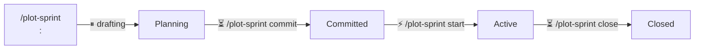

# Plot: Sprint

Sprints are **not plans**. Plans track *what* to build; sprints track *when* to ship it. Sprint files live in `docs/sprints/`. The initial skeleton commits directly to main; subsequent Planning-phase refinement may optionally happen on a `sprint/<slug>` branch with a draft PR for review. Principle 2 ("Plans merge before implementation") does not apply to sprints — sprints don't spawn implementation branches — but the *refinement* benefits from the same review surface.

**Input:** `$ARGUMENTS` determines the subcommand.

| Form | Action |
|------|--------|
| `/plot-sprint` | Status (infer slug or list all) |
| `/plot-sprint <slug>` | Status of slug (or create if not found) |
| `/plot-sprint <slug> commit` | Lock sprint contents |
| `/plot-sprint <slug> start` | Begin the sprint |
| `/plot-sprint <slug> close` | End timebox, capture retro |
| `/plot-sprint <slug> add/remove/reprio` | Change sprint scope (see Scope Change) |
| `/plot-sprint <slug>: <goal>` | Create slug with goal |

**Argument parsing:** `$ARGUMENTS` = `[<slug>] [<subcommand>] [<args>]`

- `$ARGUMENTS[0]` → slug (first word, if present)
- `$ARGUMENTS[1]` → subcommand: `commit`, `start`, `close`
- Create detected by `:` in slug token (e.g. `week-1: Ship auth`)
- If no slug given: discover from `docs/sprints/active/` — one active sprint → use it, multiple → list and ask, none → offer to create

<!-- keep in sync with plot/SKILL.md Setup -->
## Setup

Add a `## Plot Config` section to the adopting project's `CLAUDE.md`:

    ## Plot Config
    <!-- Optional: uncomment if using a GitHub Projects board -->
    <!-- - **Project board:** owner/number (e.g. eins78/5) -->
    - **Branch prefixes:** idea/, feature/, bug/, docs/, infra/
    - **Plan directory:** docs/plans/
    - **Active index:** docs/plans/active/
    - **Delivered index:** docs/plans/delivered/
    - **Sprint directory:** docs/sprints/

## Model Guidance

| Steps | Min. Tier | Notes |
|-------|-----------|-------|
| Create, commit, start | Small | Git commands, templates, file ops |
| Status | Small | File existence checks for delivery state are mechanical; no judgment needed |
| Close | Mid | False-positive detection (cross-reference `[x]` against `docs/plans/delivered/`) plus existing checkbox parsing |

All sprint operations are structural (Small or Mid). No Frontier needed.

> **User interaction:** Use `AskUserQuestion` (Claude Code) / `ask_question` (Cursor) for all questions, proposals, and confirmations.

## Sprint Lifecycle



Legend: ⚡ automate ASAP · ⏸ natural pause · ⏳ human-paced

## Guardrails

### Plan vs Sprint

Sprint files must not contain `## Design` or `## Approach` sections. If detected, warn: "This looks like a plan, not a sprint. Use `/plot-idea` for plans."

### Phase Transitions

The `Phase` field is only updated by named subcommands: `commit`, `start`, `close`. Any other action — opening a PR for review, refining items, adjusting dates, fixing typos — leaves the phase unchanged. If the user says "start a PR for the sprint", that means open a draft PR for plan review, not `/plot-sprint <slug> start`. When in doubt, ask which subcommand the user means.

## Subcommands

### Create: `/plot-sprint <slug>: <goal>`

Create a new sprint in Planning phase.

**Pacing:** ⏸ natural pause (drafting)

#### 1. Parse Input

Extract `<slug>` (before the colon) and `<goal>` (after the colon). Both are required.

- Slug: trimmed, lowercase, hyphens only
- Goal: the sprint goal as a sentence

If no colon or missing parts: "Usage: `/plot-sprint <slug>: <goal>`"

**Multiline input:** If `$ARGUMENTS` contains newlines, the first line is parsed for slug + goal as above. Any subsequent lines are treated as **context for the goal** (e.g., motivation, scope hints) and become the body of the `## Sprint Goal` section in the new sprint file — not the one-line `> <sprint goal>` headline.

#### 2. Determine ISO Week Prefix

Derive the ISO week prefix from today's date for the filename:

```bash
WEEK_PREFIX=$(date -u +%Y-W%V)
```

The sprint file will be named `docs/sprints/${WEEK_PREFIX}-<slug>.md`.

#### 3. Pre-flight Checks

```bash
ls docs/sprints/${WEEK_PREFIX}-<slug>.md 2>/dev/null
```

If file exists: "Sprint `<slug>` already exists for week ${WEEK_PREFIX}."

#### 4. Discover Active Plans

List active plans so the user can add them to the sprint:

```bash
ls docs/plans/active/ 2>/dev/null
```

If plans exist, present: "Found N active plans. Add any to this sprint?" List them and let the user select which to include (or none). Selected plans are added as `[slug]` items under the appropriate MoSCoW tier.

#### 5. Create Sprint File

```bash
mkdir -p docs/sprints
```

Write `docs/sprints/${WEEK_PREFIX}-<slug>.md` using the template from `skills/plot/templates/sprint.md`, substituting `<title>` and `<sprint goal>`.

Item format: `- [ ] [slug] description` (plan reference) or `- [ ] description` (lightweight task).

#### Item Annotations

Plan-backed items carry HTML comment annotations for automation tracking:

```markdown
- [ ] [slug] description <!-- pr: #N, status: draft, branch: feature/slug -->
```

| Field | Set by | Values |
|-------|--------|--------|
| `pr` | `/plot-approve` | PR number (`#N`) or `none` |
| `status` | `/plot-approve`, `/plot-deliver`, `/plot-reject` | `not-started`, `draft`, `open`, `merged`, `delivered`, `rejected` |
| `branch` | `/plot-approve` | Implementation branch name |
| `reviewed_at` | Review tracking | ISO 8601 timestamp |
| `review_sha` | Review tracking | HEAD SHA at time of review |

Annotations are created by `/plot-approve` and updated by `/plot-deliver`. The status subcommand reads them for enriched output.

#### Review Tracking

The `review_sha` annotation enables skip-if-unchanged review:

1. Compare current HEAD SHA of the PR branch to the `review_sha` in the annotation
2. If same → no new commits since last review, skip
3. If different → new commits, needs re-review
4. If status is `merged` → never needs review

Use `skills/plot/scripts/plot-review-status.sh <sprint-slug>` to get review freshness for all sprint items as JSON.

Leave Start/End dates as placeholders — the user fills them during the Planning phase.

#### 6. Update Plan Files

For each plan-backed item (`[slug]`) added in step 4, update the referenced plan file to record sprint membership:

- Resolve the plan file via `docs/plans/active/<slug>.md`
- Add `- **Sprint:** <sprint-slug>` to its `## Status` section (after the Phase line)

This enables sprint awareness in `/plot-approve` and `/plot-deliver`.

#### 7. Commit Skeleton to Main

Commit the initial sprint skeleton directly to main:

```bash
git add docs/sprints/${WEEK_PREFIX}-<slug>.md docs/plans/
git commit -m "sprint: create <slug>"
git push
```

Refinement (fleshing out items, readiness assessments, deferrals) happens optionally on a `sprint/<slug>` branch with a draft PR — see "Refine via PR (optional)" below.

#### 8. Summary

Print:
- Created: `docs/sprints/${WEEK_PREFIX}-<slug>.md`
- Sprint: `[*] Planning > [ ] Committed > [ ] Active > [ ] Closed`
- Plan files updated: N (if any)
- Next: add items, set dates, then `/plot-sprint <slug> commit` when ready

---

### Refine via PR (optional)

Once the skeleton is on main, sprint refinement can move to a `sprint/<slug>` feature branch with a draft PR. This is optional — small or solo sprints can stay on main. Use a PR when:

- Multiple stakeholders need to review scope before locking
- Readiness assessments or deferral decisions deserve their own commits in history
- The sprint is large enough that scope conversations benefit from inline comments

**Phase stays `Planning` throughout the PR.** The `commit` subcommand handles the phase bump and merge atomically (see Commit subcommand below).

Workflow:

1. `git checkout -b sprint/<slug> origin/main`
2. Refine the sprint file on the branch (one commit per substantive change — readiness, defer X, set dates)
3. `gh pr create --draft --title "Sprint: <goal>" --body "..."` — keep as draft while in Planning phase
4. Phase stays `Planning` throughout. Do NOT change the phase here.
5. When the team agrees: run `/plot-sprint <slug> commit` (see Commit subcommand for PR-aware behavior).

---

### Commit: `/plot-sprint <slug> commit`

Lock sprint contents. Team has agreed on what's in scope.

**Pacing:** ⏳ human-paced (team agreement)

#### 1. Find Sprint File

```bash
ls docs/sprints/*-<slug>.md 2>/dev/null
```

If not found: "No sprint found for `<slug>`."

Read the sprint file. Check Phase field:
- If not `Planning`: "Sprint is in `<phase>` phase, not Planning. Cannot commit."

#### 2. Validate End Date

Check that the `**End:**` field has a real date (not the placeholder `YYYY-MM-DD`).

If missing or placeholder: "Set an end date before committing. Edit the sprint file directly."

#### 3. Detect Sprint PR

Run `gh pr list --head sprint/<slug> --json number,state,isDraft --jq '.[]'`.

- **PR exists and not merged:** proceed to step 4a (PR-aware commit)
- **No PR / PR already merged:** proceed to step 4b (direct main commit)

#### 4a. PR-Aware Commit

Update phase **on the PR branch**, push, mark ready, merge:

```bash
# Should already be on sprint/<slug> branch — confirm with: git branch --show-current
# If not, check it out worktree-safe: git checkout -b sprint/<slug> origin/sprint/<slug>

# Bump phase in the sprint file
# **Phase:** Planning → **Phase:** Committed
git add docs/sprints/*-<slug>.md
git commit -m "sprint: commit <slug>"
git push

gh pr ready <number>          # if currently draft
gh pr merge <number> --merge --delete-branch
```

Default to **merge commits** (`--merge`) to preserve granular planning history (readiness, deferrals, scope changes are valuable context). If the project's `CLAUDE.md` specifies a different merge strategy, follow that instead. Do NOT default to `--squash` — it collapses the planning trail.

The merge itself is the "scope locked" transition. No follow-up commit on main needed.

#### 4b. Direct Main Commit (no PR)

```bash
# Bump phase in the sprint file
# **Phase:** Planning → **Phase:** Committed
git add docs/sprints/*-<slug>.md
git commit -m "sprint: commit <slug>"
git push
```

#### 5. Summary

Print:
- Committed: `<slug>`
- Sprint: `[ ] Planning > [x] Committed > [ ] Active > [ ] Closed`
- End date: `<end date>`
- Items: N must-haves, N should-haves, N could-haves
- Next: `/plot-sprint <slug> start` when the sprint begins

---

### Start: `/plot-sprint <slug> start`

Begin the sprint. Creates the active symlink.

**Pacing:** ⚡ automate ASAP (mechanical transition)

#### 1. Find and Validate Sprint File

Find sprint file, check Phase is `Committed`.

#### 2. Create Active Symlink

```bash
mkdir -p docs/sprints/active
ln -s ../${WEEK_PREFIX}-<slug>.md docs/sprints/active/<slug>.md
```

#### 3. Update Phase

Change `**Phase:** Committed` → `**Phase:** Active`

#### 4. Commit

```bash
git add docs/sprints/*-<slug>.md docs/sprints/active/<slug>.md
git commit -m "sprint: start <slug>"
git push
```

#### 5. Summary

Print:
- Started: `<slug>`
- Sprint: `[ ] Planning > [ ] Committed > [x] Active > [ ] Closed`
- End date: `<end date>`
- Active symlink: `docs/sprints/active/<slug>.md`
- Next: work on sprint items. When timebox ends, `/plot-sprint <slug> close`

---

### Close: `/plot-sprint <slug> close`

End the timebox. Check MoSCoW completeness and capture retrospective.

**Pacing:** ⏳ human-paced (retrospective)

#### 1. Find and Validate Sprint File

Find sprint file, check Phase is `Active`.

#### 2. MoSCoW Completeness Check

Parse the sprint file for checkbox items in each tier:

- Count checked `- [x]` vs unchecked `- [ ]` items per tier
- **For each `[x]` item with a `[slug]` reference, verify the plan is actually delivered:**
  - Check `docs/plans/delivered/<slug>.md` (file or symlink) exists
  - If the plan is in `docs/plans/active/<slug>.md` or missing entirely, this is a **false-positive completion**

Present results, listing any false positives **before** the totals:

```
⚠ False-positive completions detected:
  - [slug] — checked but plan is in active/ (not delivered)
  - [slug] — checked but plan file not found

Must Have:  2/4 complete (1 false positive)
Should Have: 1/2 complete
Could Have:  0/1 complete
```

**If false positives exist, do NOT proceed to close until the user resolves them.** Present three options:
1. **Run `/plot-deliver <slug>`** for each false-positive item (preferred — actually delivers the plan)
2. **Uncheck the box** in the sprint file (acknowledges it's not really done)
3. **Override and close anyway** (last resort) — requires logging a one-liner reason in the sprint file's `## Notes > ### Scope Changes` section, mirroring the existing scope-change log convention. Format: `- YYYY-MM-DD: Closed with [slug] marked complete despite plan not delivered — <reason>`

After false positives are resolved, continue with the regular Must-Have completeness flow:

If must-haves are incomplete, present three options:
1. Close anyway (must-haves stay unchecked in place)
2. Move incomplete must-haves to Deferred — move each unchecked `- [ ]` line from `### Must Have` to `### Deferred`, preserving the original text
3. Hold off (don't close yet)

#### 3. Capture Retrospective

Ask the user: "Add a retrospective? (optional)"

If yes, prompt for:
- What went well?
- What could improve?
- Action items for next sprint?

Fill the `## Retrospective` section using the template from `skills/plot/templates/retrospective.md`. Include the Metrics subsection with actual counts from step 2.

#### 4. Update Phase and Remove Symlink

Change `**Phase:** Active` → `**Phase:** Closed`

```bash
git rm docs/sprints/active/<slug>.md
git add docs/sprints/*-<slug>.md
git commit -m "sprint: close <slug>"
git push
```

#### 5. Summary

Print:
- Closed: `<slug>`
- Sprint: `[ ] Planning > [ ] Committed > [ ] Active > [x] Closed`
- Must-haves: N/M complete
- Deferred: N items (if any moved)
- Retrospective: captured / skipped
- Suggested next actions:
  1. Review the retrospective action items
  2. Carry deferred items to the next sprint: `/plot-sprint <new-slug>: <goal>`
  3. If all planned work is delivered: `/plot-release` to cut a release

---

### Scope Change

Scope changes are allowed during Active (or Committed) sprints. All changes are logged in the sprint file's `## Notes > ### Scope Changes` section for traceability.

**Adding items mid-sprint:**
- Add the new `- [ ]` item to the appropriate MoSCoW tier
- Log: `- YYYY-MM-DD: Added [slug] to Must/Should/Could — <reason>`
- If plan-backed (`[slug]`), update the plan's Sprint field

**Removing or deferring items:**
- Move the item to the `### Deferred` section (do not delete — preserve history)
- Log: `- YYYY-MM-DD: Deferred [slug] from Must — <reason>`

**Changing MoSCoW tier:**
- Move the item between tier sections (e.g., Must → Should)
- Log: `- YYYY-MM-DD: Reprioritized [slug] Must → Should — <reason>`

Commit scope changes directly to main with message: `sprint: scope change <slug>`.

---

### Status: `/plot-sprint` or `/plot-sprint <slug>`

Show sprint status.

#### 1. Resolve Slug

**If slug provided** (`$ARGUMENTS[0]` present, no subcommand):
- Find sprint file: `ls docs/sprints/*-<slug>.md 2>/dev/null`
- Found → show status for that sprint (step 2)
- Not found → "No sprint `<slug>` found. Create it with `/plot-sprint <slug>: <goal>`"

**If no arguments:**
- List active sprints: `ls docs/sprints/active/ 2>/dev/null`
- One active sprint → use it, show status (step 2)
- Multiple → list all active sprints with summary
- None → "No active sprints. Create one with `/plot-sprint <slug>: <goal>`"

#### 2. For Each Sprint

Read the sprint file and display:
- Sprint name and goal
- Phase
- Time remaining (days until end date; "ended N days ago" if past)
- MoSCoW progress: Must N/M, Should N/M, Could N/M
- For plan-backed items with annotations: show PR number, status, and branch
- **False-positive flag:** for `[x]` items with `[slug]` refs, if the plan is not in `docs/plans/delivered/`, prefix the line with `⚠ ` and note `(plan not delivered)`. This makes the discrepancy visible during routine status checks, not just at close time.

#### 3. Summary

```
## Active Sprints

- `<slug>` — "<goal>" | [*] Active | 3 days remaining | Must: 2/4 | Should: 1/2 | Could: 0/1
```

---

## Common Mistakes

| Mistake | Effect | Prevention |
|---------|--------|------------|
| Closing a sprint with `[x] [slug]` items whose plans are still in `active/` | Sprint reads as complete but plans remain undelivered; `/plot-deliver` later reverts the plan to Draft | Step 2 of close runs a false-positive check; resolve via `/plot-deliver` or uncheck before closing |
| Squash-merging a sprint planning PR | Readiness/defer/dates collapse into one commit; reasoning lost | Default to `--merge` (matches `plot-approve` for plan PRs) — squash is for messy WIP, not planning |
