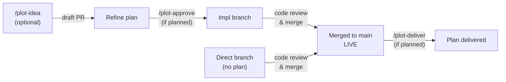
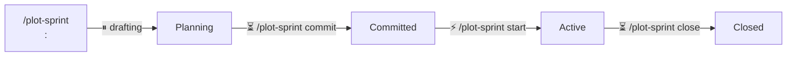
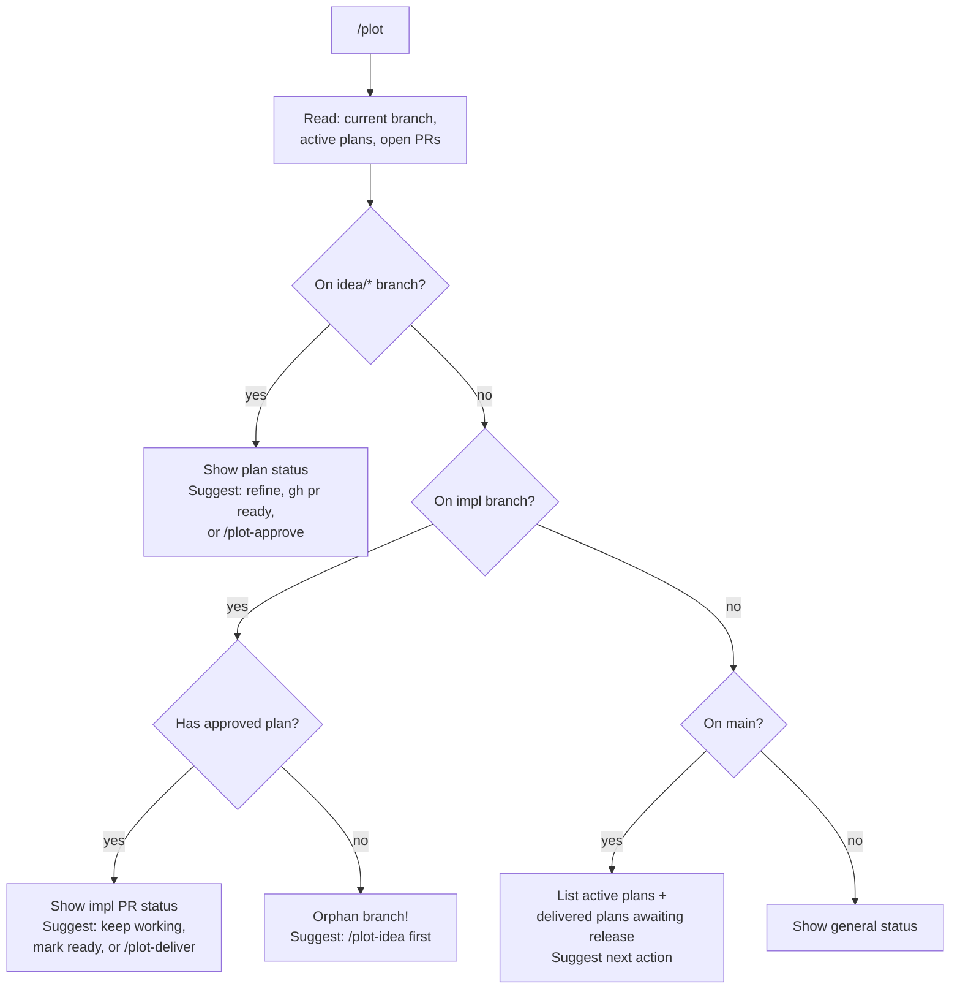

# Plot

Lean, git-native planning system. Plans are markdown files on branches, PRs are workflow metadata, git is the source of truth. Plans merge to main before implementation begins; one plan can spawn multiple parallel implementation branches. Works with any team composition — human, AI-assisted, or fully agentic.

> **Human-facing tutorial:** [intro-to-using-plot.md](intro-to-using-plot.md). The instructions below are the dispatcher's reference manual.

## Setup

Add a `## Plot Config` section to the adopting project's `CLAUDE.md`:

    ## Plot Config
    <!-- Optional: uncomment if using a GitHub Projects board -->
    <!-- - **Project board:** owner/number (e.g. eins78/5) -->
    - **Branch prefixes:** idea/, feature/, bug/, docs/, infra/
    - **Plan directory:** docs/plans/
    - **Active index:** docs/plans/active/
    - **Delivered index:** docs/plans/delivered/
    - **Sprint directory:** docs/sprints/

## Model Guidance

| Steps | Min. Tier | Notes |
|-------|-----------|-------|
| 1. Read State | Small | Git/gh commands, file listing |
| 2. Detect Context | Small | Branch name pattern matching |
| 3. Detect Issues | Small (most), Mid (overlap) | Overlapping plans (3+ shared words) needs mid-tier |
| 4. Status Summary | Small | Template formatting |
| Sprint listing | Small | File listing, date arithmetic |
| Sprint countdown | Small | Date comparison, checkbox counting |

All dispatcher steps are mechanical except the "Overlapping plans" heuristic in step 3, which requires comparing plan titles. A small model should skip title comparison and only flag exact slug duplicates.

## Lifecycle

### Feature / Bug (full lifecycle)

```mermaid
flowchart LR
    subgraph Planning
        A["/plot-idea"] -->|draft PR| B["Refine &<br/>slice branches"]
        B -.->|"optional: tracer-bullets"| B2["Tracer on<br/>idea branch"]
        B2 --> C
        B -->|"⏳ gh pr ready"| C["Review plan"]
    end
    subgraph Approval
        C -->|"⏳ /plot-approve<br/>(or PR already merged)"| D["Plan merged<br/>impl PRs created"]
    end
    subgraph Implementation
        D -.->|"optional: tracer-bullets"| D2["Tracer branch<br/>merged first"]
        D2 -->|"create remaining branches"| E
        D -->|"⚡ create branches"| E["Work on<br/>impl branches"]
        E -->|"⏸ draft → review → merge<br/>(standard code review)"| F["All impls<br/>merged to main"]
    end
    subgraph Delivery
        F -->|"⚡ /plot-deliver"| G["Plan delivered"]
        G -.->|"⚡ /plot-reject"| D
    end
    subgraph Release
        G -->|"⚡ /plot-release rc"| H["RC tag +<br/>checklist"]
        H -->|"⏸ endgame testing"| I{"All verified?"}
        I -->|"no: fix → new RC"| H
        I -->|"⏳ sign-off"| J["⚡ /plot-release"]
    end
```



Legend: ⚡ automate ASAP · ⏸ natural pause · ⏳ human-paced

### Docs / Infra (live when merged)



### Sprint Lifecycle



Sprints are an optional temporal lens over plans. Sprint files live in `docs/sprints/`, committed directly to main. See `/plot-sprint` for full details.

### Direct Work (no planning step)

Small features, bug fixes, docs, and infra tasks go directly to a PR:

```
feature/<slug>  →  PR  →  merge
bug/<slug>      →  PR  →  merge
docs/<slug>     →  PR  →  merge
infra/<slug>    →  PR  →  merge
```

## Phases

### Plan Phases

| Phase | Meaning | Trigger | Transition Pacing |
|-------|---------|---------|-------------------|
| Draft | Plan being written/refined | `/plot-idea` | ⏸ natural pause (writing) |
| Approved | Plan merged, impl branches created | `/plot-approve` | ⏳ human-paced (review) → ⚡ automate (branch creation) |
| Delivered | All impl PRs merged, plan delivered | `/plot-deliver` | ⏸ natural pause (implementation) → ⚡ automate (delivery) |
| Delivered → Approved | Premature delivery reversed | `/plot-reject` | ⚡ automate |
| Released | Included in a versioned release | `/plot-release` | ⚡ automate (RC tag) → ⏸ endgame → ⏳ sign-off → ⏳ human-paced (version bump, tag, push) |

The Release phase includes an RC verification loop. Individual plans don't track a "Testing" phase — the release checklist does. The `tracer-bullets` skill can be used during Draft (to validate before approving) or Approved (as first implementation branch) — it is a sibling skill, not a plot phase.

### Sprint Phases

| Phase | Meaning | Trigger | Transition Pacing |
|-------|---------|---------|-------------------|
| Planning | Sprint being drafted, items selected | `/plot-sprint <slug>: <goal>` | ⏸ natural pause (drafting) |
| Committed | Team agreed on sprint contents | `/plot-sprint <slug> commit` | ⏳ human-paced (agreement) |
| Active | Sprint running, work in progress | `/plot-sprint <slug> start` | ⚡ automate ASAP |
| Closed | Timebox ended, retro captured | `/plot-sprint <slug> close` | ⏳ human-paced (retrospective) |

## Conventions

- **Branch prefixes:** `idea/` (plans), `feature/`, `bug/`, `docs/`, `infra/` (implementation)
- **Plan files:** `docs/plans/YYYY-MM-DD-<slug>.md` — date-prefixed, never move once created
- **Active index:** `docs/plans/active/<slug>.md` — symlinks to Draft/Approved plans
- **Delivered index:** `docs/plans/delivered/<slug>.md` — symlinks to Delivered plans
- **Plan PR:** starts as draft (being refined), marked ready with `gh pr ready`, titled `Plan: <title>`
- **Impl PRs:** draft, created by `/plot-approve`, reference the plan on main
- **Sprint files:** `docs/sprints/YYYY-Www-<slug>.md` — ISO week-prefixed, committed directly to main
- **Sprint active index:** `docs/sprints/active/<slug>.md` — symlinks to active sprints
- **User questions:** When a step says "ask", "propose", "warn and confirm", or "list and ask", use the `AskUserQuestion` tool (Claude Code) or `ask_question` (Cursor). This ensures the agent pauses for a real answer instead of continuing with assumptions.

## Guardrails

- `/plot-approve` requires plan PR to be non-draft or already merged — no approving unreviewed plans
- `/plot-deliver` requires all impl PRs merged — no premature delivery
- `/plot-release` requires delivered plans — cannot release undelivered work; verifies readiness but does not execute release steps without user confirmation
- `/plot-reject` requires plan to be in Delivered phase — cannot reject Draft or Approved plans
- `/plot` detects orphan impl branches (no approved plan) — prevents coding without context
- Phase field in plan files is machine-readable — every command checks current phase before acting

## Branch Safety (Worktree Compatibility)

**Never check out `main` locally.** All plot commands run on topic branches. This is essential for worktree-based workflows (e.g. `claude --worktree`) where `main` is already checked out in the primary working tree, but it's good practice everywhere.

| Instead of | Do this |
|------------|---------|
| `git checkout main` | `git checkout -b plot/<action> origin/main` (disposable branch) |
| Reading files from main | `git fetch origin main` then `git show origin/main:<path>` |
| Pushing updates to main | `git push origin <branch>:main` (direct push) or create+merge a PR |
| Switching to an existing branch | You're likely already on it in a worktree; otherwise `git checkout -b <name> origin/<name>` |

This applies to all spoke commands. `git checkout -b <new-branch> origin/main` is fine — it creates a new branch without checking out main.

## Flexibility

Natural language overrides are expected and should be honored. Users may say:

- **Batch:** "Approve and deliver in one go" — run `/plot-approve` then `/plot-deliver` sequentially
- **Skip:** "Skip the PR, just merge" — bypass draft PR if the user has context
- **Branch override:** "Use `feature/my-name` instead" — accept non-standard branch names
- **Combine:** "Create the plan and add it to the sprint" — chain `/plot-idea` + `/plot-sprint`
- **Abbreviate:** "Deliver everything" — iterate over all active plans

**Relationship:** Guardrails protect (prevent data loss, enforce phase ordering). Flexibility serves (reduce ceremony when the user knows what they want). If an override would violate a guardrail, confirm with the user before proceeding.

## What Goes Where

| Concern | Reusable Skill (SKILL.md) | Project CLAUDE.md |
|---------|--------------------------|-------------------|
| Workflow steps & lifecycle | Yes | No |
| Branch naming conventions | Yes (defaults) | Override if different |
| Directory paths | No | Yes (`docs/plans/`, etc.) |
| Project board (`owner/number`) | No | Yes |
| Merge strategy preference | No | Yes |
| Release note tooling | No | Yes (or auto-detected) |
| Sprint cadence / dates | No | Yes (or in sprint file) |

**Rule of thumb:** If it changes per project, it belongs in CLAUDE.md. If it's the same everywhere, it belongs in the skill.

See `skills/plot/templates/claude-md-snippet.md` for a ready-to-paste template.

## Local Status Board

> **🧪 Beta** — functional but rough edges remain (look-and-feel, live reload, click targets). Feedback welcome.

Plot ships a local Kanban board for maintainers who want a glanceable view of plan phases without GitHub auth or latency. Start it with:

```bash
pnpm board   # serves http://localhost:7777 (override: PORT=8080 pnpm board)
```

The board reads `docs/plans/` and `docs/sprints/` from the repo root, renders 4 columns (Draft / Approved / Delivered / Released), and supports sprint filtering via the URL `?sprint=<slug>`. It is a read-only, local-only tool — no writes, no external dependencies at runtime.

The board is a script (`skills/plot/scripts/board/server.mjs`), not a skill step, so it has no row in the Model Guidance table.

## Sibling Skills

Plot works with standalone development strategy skills. These are not plot spokes — they have their own workflows and can be used independently, but they ship with this plugin. Plot references them at appropriate moments.

### challenge-the-plan

Interrogates a plan through adaptive interviews (technical, domain, UX, non-functional) before approval. Natural slot in the lifecycle: after `/plot-idea` refinement, before `gh pr ready` / `/plot-approve` — wrong directions get caught while they still cost markdown edits, not code. Works on any PLAN/SPEC/STORY file; no plot conventions required.

### story-tracking

Stories (`docs/stories/{slug}/`) are the long-running umbrella around plans: research, decisions, and session narrative that span multiple plans and sessions. Plans stay the approved, actionable units. A story references its plans; a plan's `## Context` may link back to the story. Neither requires the other — see the `story-tracking` skill.

### tracer-bullets

Plans can define a `### Tracer` subsection in `## Branches` (see plan template). When using `### Tracer`, wrap remaining branches in a `### Implementation` subsection — `/plot-approve` parses only `### Implementation` and skips tracer branches. Format:

```markdown
### Tracer
- `feature/<slug>-tracer` — <thin slice description>
  Layers: <layer> → <layer> → <layer>
  Proves: <what this validates>
  Status: Not started | In progress | Complete
```

**Pre-approval (Draft):** Tracer code lives on the `idea/<slug>` branch alongside plan files. Update `Status:` to `Complete` and add a `## Tracer Results` section with findings. Tracer code carries forward when the plan PR merges.

**Post-approval (Approved):** Create `feature/<slug>-tracer` branch from main. Merge the thin slice before creating remaining implementation branches.

`/plot-approve` step 2b suggests a tracer bullet when uncertainty or feature size warrants it.

## Troubleshooting

### Plan PR has merge conflicts

The `idea/<slug>` branch has diverged from main. You should already be on this branch (or in a worktree for it).

```bash
git fetch origin main
git rebase origin/main
# Resolve conflicts
git push --force-with-lease
```

Then retry `/plot-approve <slug>`.

### Implementation PR fails CI

1. Check CI logs: `gh pr checks <number>`
2. Fix on the implementation branch, push
3. Wait for CI to pass, then merge normally

If CI is flaky or irrelevant to this PR, the human decides whether to merge anyway.

### Premature delivery (incomplete branches)

`/plot-deliver` was run before all branches were built (e.g., branch verification gate wasn't in place). Options:

1. **Reject** — `/plot-reject <slug>` to move back to Approved, then build remaining branches
2. **Fix forward** — if the gap is small, build remaining branches and re-deliver without rejecting

### Delivery check finds incomplete work

`/plot-deliver` reports partial/missing deliverables. Options:

1. **Hold off** — go finish the work, then re-run `/plot-deliver`
2. **Deliver anyway** — accept the gap (the skill asks for confirmation)
3. **Update the plan** — if scope changed, edit the plan file on main to match what was actually built, then re-run `/plot-deliver`

### Plan file Phase is out of sync

If the Phase field doesn't match reality (e.g., plan says "Draft" but PR is merged):

```bash
git fetch origin main
git checkout -b plot/fix-phase-<slug> origin/main
# Fix the Phase field in docs/plans/YYYY-MM-DD-<slug>.md
git add docs/plans/YYYY-MM-DD-<slug>.md
git commit -m "plot: fix phase for <slug>"
git push origin plot/fix-phase-<slug>:main
```

### Orphan implementation branch

`/plot` warns about impl branches with no approved plan. Options:

1. **Create the plan retroactively** — `/plot-idea <slug>: <title>`, approve it
2. **Just merge it** — if the work is small, skip the plan and merge directly
3. **Delete the branch** — if the work is abandoned

### Release check finds missing release notes

`/plot-release` cross-check reports gaps. Options:

1. **Add the missing entries** — update CHANGELOG.md or add changeset files
2. **Proceed anyway** — if the gap is intentional (internal change, no user impact)
3. **Go back to deliver** — if a plan was missed entirely

### Sprint past end date with incomplete must-haves

`/plot-sprint close` shows incomplete must-haves. Options:

1. **Close anyway** — must-haves stay unchecked in place as a record
2. **Move to Deferred** — explicitly acknowledge they didn't make the timebox
3. **Extend the sprint** — edit the End date (but consider: is this hiding a scope problem?)

## Automation Output

When the conversation context indicates automation, append a fenced JSON block after the normal human-readable summary. Normal output is always produced first — JSON is appended, never replaces.

### Detection

Automation mode is active when any of these are true:
- Words like "automation", "machine-readable", "ralph" appear in conversation context
- `Output format: json` is set in the project's `## Plot Config`

### Schema

Each spoke skill appends a `json plot-output` fenced block:

```json
{
  "command": "/plot-deliver",
  "slug": "sse-backpressure",
  "phase": "Delivered",
  "status": "delivered",
  "prs": [{"number": 12, "state": "MERGED"}, {"number": 13, "state": "MERGED"}],
  "sprint": "week-1",
  "next_action": "/plot-release",
  "message": "All implementation PRs merged. Plan delivered."
}
```

| Field | Type | Description |
|-------|------|-------------|
| `command` | string | Which skill produced this output |
| `slug` | string | The plan or sprint slug |
| `phase` | string | Current phase after this action |
| `status` | string | Result: "created", "approved", "delivered", "rejected", "released", "error" |
| `prs` | array? | PR numbers and states |
| `sprint` | string? | Sprint slug if plan is in a sprint |
| `next_action` | string | Suggested next command |
| `message` | string | Human-readable one-line summary |

### Progress Object (optional)

For plan lifecycle commands, include a `progress` field:

```json
"progress": {"draft": true, "approved": true, "delivered": true, "released": false}
```

## Dispatcher

The `/plot` command analyzes current git state and suggests the next action.

### Decision Tree



### 1. Read State

Gather context in parallel:

```bash
# Current branch
BRANCH=$(git branch --show-current)

# Active plans on main
ls docs/plans/active/ 2>/dev/null

# Delivered plans
ls docs/plans/delivered/ 2>/dev/null

# Active sprints
ls docs/sprints/active/ 2>/dev/null

# Open PRs on idea/ branches
gh pr list --json number,title,headRefName,isDraft,state --jq '.[] | select(.headRefName | startswith("idea/"))'

# Open PRs on impl branches (feature/, bug/, docs/, infra/)
gh pr list --json number,title,headRefName,isDraft,state --jq '.[] | select(.headRefName | startswith("feature/") or startswith("bug/") or startswith("docs/") or startswith("infra/"))'
```

Also run the bash helpers if a specific slug is in context:
- `./scripts/plot-pr-state.sh <slug>` — plan PR state
- `./scripts/plot-impl-status.sh <slug>` — impl PR states

### 2. Detect Current Context

**If on an `idea/*` branch:**
- Read the plan file from `docs/plans/<slug>.md` on this branch
- Check plan PR state (draft / ready / merged)
- Suggest:
  - If plan PR is draft: "Plan is still a draft. Refine it, then run `gh pr ready <number>` when ready for review."
  - If plan PR is non-draft (ready for review): "Plan is ready for review. Run `/plot-approve <slug>` to merge and create impl branches."
  - If plan PR is merged: "Plan is already approved. Run `/plot-approve <slug>` to create impl branches (if not already created)."

**If on an impl branch (`feature/*`, `bug/*`, `docs/*`, `infra/*`):**
- Check if there's a corresponding approved plan via `docs/plans/active/<slug>.md` on main
- If plan exists: show impl PR status, suggest keep working / mark ready / `/plot-deliver`
- If no plan exists: warn "Orphan branch — no approved plan found. Consider running `/plot-idea` first."

**If on `main`:**
- List all active plans with their phases
- List any delivered plans awaiting release (from `docs/plans/delivered/`). For each, optionally compare plan branches vs merged PRs — if unbuilt branches exist, suggest `/plot-reject <slug>`
- List active sprints with countdown and progress: `week-1 — "Ship auth improvements" | 3 days remaining | Must: 2/4 done`. Past end date: show "ended 2 days ago" factually — no warning tone, no nagging.
- Show overall status summary
- Suggest next action based on what's pending

**Otherwise:**
- Show general status: active plans, open PRs, recent deliveries

### 3. Detect Issues

Flag any problems found:

- **Orphan impl branches**: branches with `feature/`, `bug/`, `docs/`, `infra/` prefix that have no corresponding plan in `docs/plans/`
- **Phase mismatches**: plan says Draft but PR is non-draft, or plan says Approved but PR is still open
- **Completed drafts**: impl PRs still in `isDraft: true` state whose branch has commits beyond the initial branch cut (real implementation work has been pushed) — suggest `gh pr ready <n>`; reviewers filter by PR state, so a draft with completed work is invisible to them
- **Abandoned drafts**: impl PRs in draft state with no new commits for >7 days — surface for cleanup
- **Overlapping plans**: Draft/Approved plans with titles sharing 3+ significant words — flag in the status summary as informational (no blocking)
- **Sprints past end date**: active sprints where end date has passed — flag as informational
- **Multiple active sprints**: more than one active sprint — flag as informational

> **Smaller models:** Skip title-similarity detection. Only report exact slug matches (identical filenames). Title overlap detection requires mid-tier reasoning.

### 4. Status Summary

Print a clear summary:

```
## Plot Status

### Active Plans
- `<slug>` — Phase: <phase> | Plan PR: #<n> (<state>) | Impl PRs: <count> merged / <count> total

### Active Sprints
- `<slug>` — "<goal>" | <N> days remaining | Must: <n>/<m> | Should: <n>/<m> | Could: <n>/<m>

### Issues
- <issue description>

### Suggested Next Step
> <specific command or action>
```

## Self-Improvement

If you encounter a workflow gap, a broken convention, or missing guidance in any Plot skill (plot, plot-idea, plot-approve, plot-deliver, plot-release, plot-sprint), don't just work around it — fix the skill:

1. **Create a PR** from a fresh worktree of `https://github.com/plot-pm/plot` on a new branch, fixing the issue directly
2. **Or file an issue** on `https://github.com/plot-pm/plot` with: what failed, the actual behavior, and the suggested fix

Never silently work around a skill gap. The fix benefits all future sessions.
